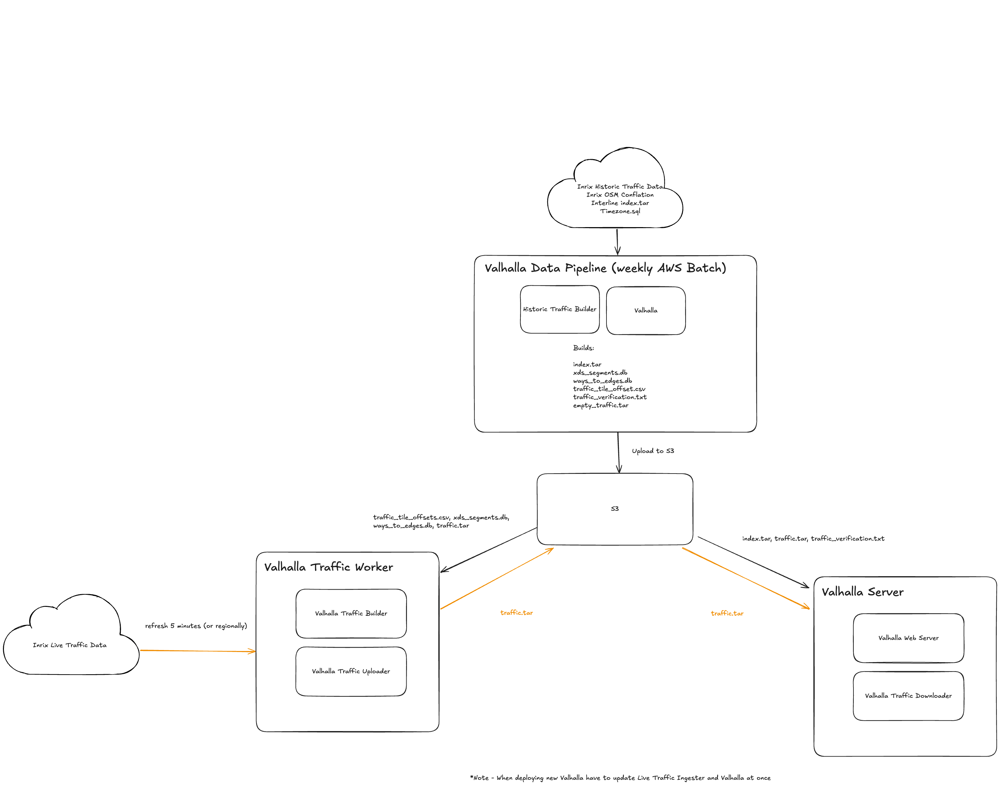

# README Radar
Read me for Radar Fork.

For all S3 buckets you can replace 2025-08-10 with any date on S3 (just don't use the prod one). Note that index's have to be built off of each other. ie 2025-08-10 traffic.tar has to go with 2025-08-10 index.tar

## Quick Start
This will grab everything you need to run Valhalla without live traffic

Compiling Valhalla mostly follows along building from source on MacOS https://valhalla.github.io/valhalla/building/

The first time you compile it may take ~20 minutes

```bash
## Prime server dependencies and prime server
brew install autoconf automake zmq czmq
git clone https://github.com/kevinkreiser/prime_server.git
cd prime_server
git submodule update --init --recursive
# standard autotools:
./autogen.sh
./configure
make test -j8
sudo make install

## Valhalla dependencies
# install dependencies (automake & czmq are required by prime_server)
brew install automake cmake libtool protobuf-c libspatialite pkg-config sqlite3 jq curl wget czmq lz4 spatialite-tools unzip luajit boost
# following packages are needed for running Linux compatible scripts
brew install bash coreutils binutils
# Update your PATH env variable to include /usr/local/opt/binutils/bin:/usr/local/opt/coreutils/libexec/gnubin
git clone git@github.com:radarlabs/valhalla-source.git --recurse-submodules
cd valhalla-source
git checkout traffic

## Compiling Valhalla (from then on you only need to do this step on changes to Valhalla)
cmake -B build -DCMAKE_BUILD_TYPE=Release -DENABLE_NAPI_BINDINGS=OFF
make -C build -j$(sysctl -n hw.physicalcpu)
sudo make -C build install


## Download ~100GB from S3 so will take an hour to download (or if you want you can build a smaller index here: https://valhalla.github.io/valhalla/building/#running-valhalla-server-on-unix
# This will run all config and files in a separate directory valhalla-server
mkdir -p valhalla-server
cd valhalla-server
s5cmd cp --concurrency 256 s3://io.radar.valhalla/2025-08-10/index.tar .
s5cmd cp --concurrency 256 s3://io.radar.valhalla/2025-08-10/traffic.tar .


# Generate default config file
valhalla_build_config --mjolnir-tile-dir ${PWD}/tiles --mjolnir-tile-extract ${PWD}/index.tar --mjolnir-timezone ${PWD}/tiles/timezones.sqlite --mjolnir-traffic-extract ${PWD}/traffic.tar  > valhalla.json

## Run Valhalla
valhalla_service valhalla.json 8
```


Inspecting the server
```bash
# Curl directly
curl http://localhost:8002/route --data '{"locations":[{"lat":47.365109,"lon":8.546824,"type":"break","city":"Zürich","state":"Altstadt"},{"lat":47.108878,"lon":8.394801,"type":"break","city":"6037 Root","state":"Untere Waldstrasse"}],"costing":"auto","directions_options":{"units":"miles"}}' | jq '.'

# Use Valhalla's tool to inspect
git clone --depth=1 --recurse-submodules --single-branch --branch=gh-pages https://github.com/valhalla/demos.git
open demos/routing/index-internal.html &

# Run Radar frontend superuser tools and app server locally pointing app server to http://host.docker.internal:8002 to inspect
```


## Architecture





## Used by Radar

Here are various commands that Radar will use from Valhalla

You can always pull prebuilt files ie traffic.tar/index.tar from S3 instead of building new ones from scratch


### 1. Valhalla Server
This runs the actual Valhalla instance, as well as ingest live traffic in from S3

**Running Valhalla**
```bash
# input
# cd valhalla-server
# s5cmd cp --concurrency 256 s3://io.radar.valhalla/2025-08-10/index.tar .
# s5cmd cp --concurrency 256 s3://io.radar.valhalla/2025-08-10/traffic.tar .
# valhalla_build_config --mjolnir-tile-dir ${PWD}/tiles --mjolnir-tile-extract ${PWD}/index.tar --mjolnir-timezone ${PWD}/tiles/timezones.sqlite --mjolnir-traffic-extract ${PWD}/traffic.tar  > valhalla.json

valhalla_service valhalla.json 8
```


**Verifying traffic.tar**

Verifies a traffic.tar against a traffic_verification.txt (generated below) to ensure that the traffic.tar was built from the same Valhalla index

```bash
# input
# cd valhalla-server
# s5cmd cp --concurrency 256 s3://io.radar.valhalla/2025-08-10/index.tar .
# s5cmd cp --concurrency 256 s3://io.radar.valhalla/2025-08-10/traffic.tar .
valhalla_traffic_tool --verify --traffic-path traffic_current.tar --verify-path traffic_verification.txt
```

**Copying traffic.tar**

cp doesn't work as the partial writing can cause Valhalla to crash.
Copying live traffic data from one traffic.tar to another traffic.tar. Note that step is only neccessary as we upload the traffic.tar through S3. Valhalla Traffic Worker can update the live traffic.tar in place

```bash
# input
# cd valhalla-server
# s5cmd cp --concurrency 256 s3://io.radar.valhalla/2025-08-10/traffic.tar traffic_current.tar # copy from this
# s5cmd cp --concurrency 256 s3://io.radar.valhalla/2025-08-10/empty_traffic.tar traffic.tar # into an empty traffic.tar

valhalla_traffic_tool --copy-traffic --input-traffic-path traffic_current.tar --traffic-path traffic.tar
```

### 2. Valhalla Traffic Worker
This downloads traffic data from Inrix and packages it up to a traffic.tar and uploads it to S3. Valhalla traffic worker and Valhalla doesn't have to go through S3 ie you can run both the traffic worker, and Valhalla server on the same machine and have Valhalla traffic worker modify the ***live*** traffic.tar

**Valhalla Traffic Worker**

See [Valhalla Traffic Worker](./valhalla-traffic-builder/README.md)

**Compiling NAPI**
If you want to modify and test the NAPI code you will also need node js and NAPI. This N-API code is used by Valhalla Traffic worker to add traffic data to the traffic.tar

```bash
# Assuming you have installed node from nvm
node --version
npm install -g node-addon-api
export NODE_VERSION=v20.19.0 # or your node version


# will build to ./build
cmake -B build -DCMAKE_BUILD_TYPE=Release -DENABLE_NAPI_BINDINGS=ON
make -C build -j$(sysctl -n hw.physicalcpu)
sudo make -C build install
```

This will build  `node_bindings.node` to `/build`. See [Valhalla Traffic Worker](./valhalla-traffic-builder/README.md#usage) for how to use


### 3. Valhalla Data Pipeline
This builds all latest index and all data needed for a new deploy


**Generating ways_to_edges.db**

Builds a sqlite DB of OSM way ids to Valhalla edge ids

```bash
# input
# cd valhalla-server
# s5cmd cp --concurrency 256 s3://io.radar.valhalla/2025-08-10/traffic.tar traffic.tar
# valhalla_build_config --mjolnir-tile-dir ${PWD}/tiles --mjolnir-tile-extract ${PWD}/index.tar --mjolnir-timezone ${PWD}/tiles/timezones.sqlite --mjolnir-traffic-extract ${PWD}/traffic.tar  > valhalla.json
# s5cmd cp --concurrency 256 s3://io.radar.valhalla/2025-08-10/index.tar .

tar -xvf index.tar -C tiles # untar
valhalla_ways_to_edges -c valhalla.json


mkdir -p ../data
mv way_edges.txt ./data/ways_to_edges.csv
./../radar_traffic_tools/build_db.sh
```

**Building xds_segments.db**

```bash
mkdir -p
./data/inrix-edges-csv
s5cmd cp  --concurrency 256 "s3://io.radar.valhalla/inrix-conflation/*" ./data/inrix-edges-csv
./radar_traffic_tools/build_db.sh

```


**Ingesting Historic Traffic into index.tar and generating traffic.tar**
This ingest historic traffic into Radar as well as timezone data (as the tiles from interline don't have that)

Follow steps in [Valhalla Historic Traffic Builder](./valhalla-historic-traffic-builder/README.md) to build traffic directory
```bash
# cd valhalla-server
# valhalla_build_config --mjolnir-tile-dir ${PWD}/tiles --mjolnir-tile-extract ${PWD}/index.tar --mjolnir-timezone ${PWD}/tiles/timezones.sqlite --mjolnir-traffic-extract ${PWD}/traffic.tar  > valhalla.json
# s5cmd cp --concurrency 256 s3://io.radar.valhalla/2025-08-10/index.tar .

mv ../valhalla-historic-traffic-builder/traffic ./traffic
tar -xvf index.tar -C tiles # Unzip Valhalla.index.tar into tiles directory
valhalla_build_timezones > /tiles/timezones.sqlite # add timezone data (typically done during tile build phase but we get our tiles from interline)
valhalla_add_predicted_traffic -c valhalla.json --concurrency 8 traffic # adds traffic from traffic directory to tiles

rm -rf index.tar # delete old index.tar

# Builds tiles -> new index.tar, adds timezones to index.tar, builds traffic.tar
valhalla_build_extract -c valhalla.json -v --overwrite --with-traffic
```


**Generating traffic tile offset**
```bash

# cd valhalla-server
# valhalla_build_config --mjolnir-tile-dir ${PWD}/tiles --mjolnir-tile-extract ${PWD}/index.tar --mjolnir-timezone ${PWD}/tiles/timezones.sqlite --mjolnir-traffic-extract ${PWD}/traffic.tar  > valhalla.json
# s5cmd cp --concurrency 256 s3://io.radar.valhalla/2025-08-10/traffic.tar traffic.tar

valhalla_traffic_tool --tile-offset-index -c valhalla.json
```

**Generating traffic_verify.txt**
```bash
# cd valhalla-server
# valhalla_build_config --mjolnir-tile-dir ${PWD}/tiles --mjolnir-tile-extract ${PWD}/index.tar --mjolnir-timezone ${PWD}/tiles/timezones.sqlite --mjolnir-traffic-extract ${PWD}/traffic.tar  > valhalla.json
# s5cmd cp --concurrency 256 s3://io.radar.valhalla/2025-08-10/traffic.tar traffic.tar
valhalla_traffic_tool -c valhalla.json --build-verification
```


**Other useful tools**
```
TODO:
# Find tile offset

# Re-add back in modifying traffic.tar without NAPI

```


## Custom Fork Info
Radar extends Valhalla source code in three main ways for live traffic.


1. Building various files needed for live traffic. Some of these are already built into Valhalla but we made some modifications
  a. Modified ways_to_edges which builds ways_to_edges.db. Now it includes shortcuts, direction, and length of edge
  b. Added traffic_tile_offset which builds tile offsets from a traffic.tar
  c. Added build-verification and verify CLI tools to help verify changes made to the traffic.tar to ensure that the file doesn't get corrupted
  d. Modified valhalla_add_predicted_traffic to add timezone data

2. Building a NAPI extension that is used by https://github.com/radarlabs/valhalla-traffic-builder to ingest traffic into the traffic.tar

3. Removes live traffic from bidrectional A Star searches (long routing searches)

## Radar Fork Change Log

**[2025-07-30]**
**Added**
- Added valhalla-historic-traffic-builder and valhalla-traffic-builder into valhalla repo

**Modified**
- valhalla-historic-traffic-builder to better use node js forking

**[2025-08-14]**

**[2025-08-08]**
**Modified**
- Allowed timezone data to be added during adding of traffic. (typically traffic is added when you build the tiles but since we get our tiles from interline they don't exist nad need to be added after)


**[2025-07-07]**
**Added**
- Added valhalla traffic copying

**[2025-07-01]**
**Changed**
- Fixed valhalla_service


**[2025-06-30]**
**Added**
- Added Valhalla traffic.tar verification

**Changed**
- Modified Valhalla ways to edges to add shortcuts, changed output format ready for .sqlite ingestion

**[2025-06-26]**

**Added**
- Valhalla Traffic tools
- NAPI bindings
- Compiling


## Debugging
If there is still variance compare the local valhalla.json with
https://github.com/radarlabs/infrastructure/blob/main/deploy/services/valhalla/configmap.yaml

