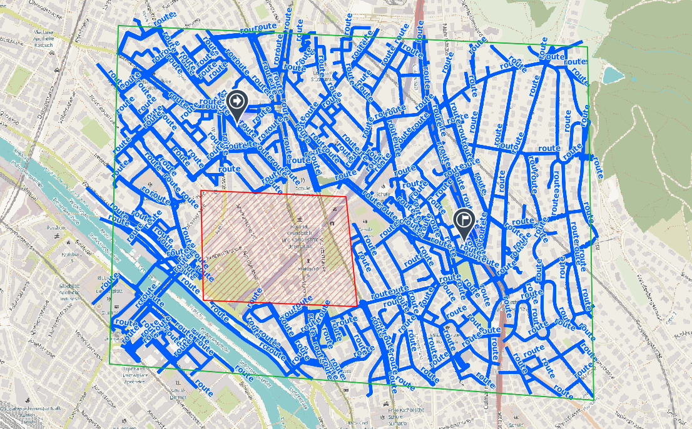
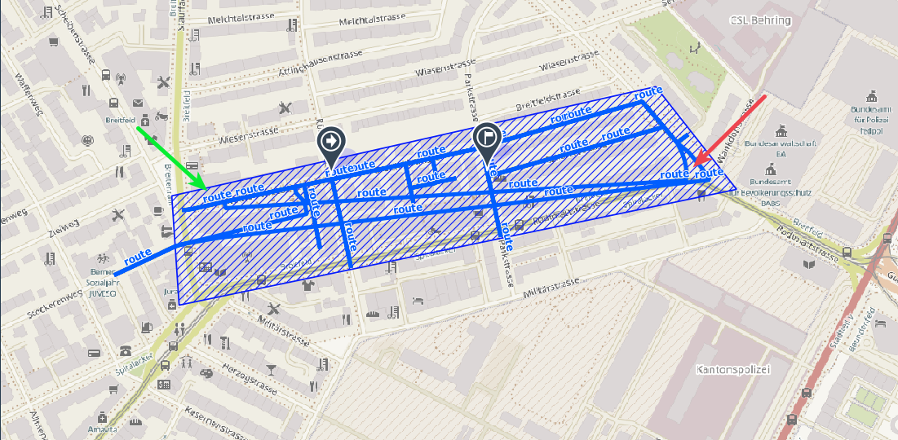
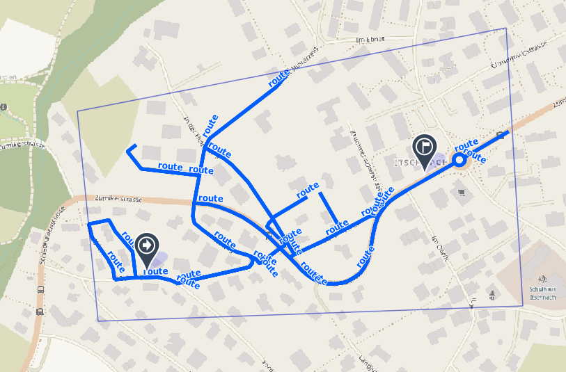

# Chinese Postman service API reference (BETA)

The chinese postman service provides a computation to find the shortest route to visit all roads in an area at least once. This problem of finding a such route is known as Chinese Postman Problem or [Route Inspection Problem](https://en.wikipedia.org/wiki/Route_inspection_problem) in graph theory. The full algorithm to solve this problem can explored with [this visualisation](https://algorithms.discrete.ma.tum.de/graph-algorithms/directed-chinese-postman/index_en.html) from Technische Universität München (TUM).

This Chinese Postman services handles a not strongly connected graph or unbalanced graph that is required by the algorithm. It will try to find a route outside the area of interest to make the graph representation balanced and strongly connected. It can also avoid area that is not interesting or forbidden for the user.

One of the example of chinese postman service is finding the most efficient patroling route.



## Inputs of the Chinese Postman service
A chinese postman requerst run locally takes the form of
```
valhalla_service valhalla.json chinese_postman input.json
```
The input is similar with the input used in [routing API](/turn-by-turn/api-reference.md). The only difference are the chinese_postman_polygon element and the number of location must be 2 (origin and destination) as shown in the example below:
```json
{
    "costing": "auto",
    "show_locations": true,
    "locations": [
        {"lon": 7.456664, "lat": 46.960088},
        {"lon": 7.458741, "lat": 46.960125}
    ],
    "directions_options": {"language": "en"},
    "costing_options": {
        "auto": {"top_speed": "120"}
    },
    "chinese_postman_polygon": [
        [7.454549502460818, 46.95991070945693],
        [7.460964877505169, 46.960902157294164],
        [7.462035473203115, 46.959968738129405],
        [7.4546465845295184, 46.95891823060178],
        [7.454549502460818, 46.95991070945693]
        ]
}

```

The response is of the Chinese Postman service is in the same format as in the routing API. Thus one can use the response for turn-by-turn navigation also.

## Rule for chinese postman polygon and exclude polygons

The chinese postman service will consider all road that **within** the chinese polygon but not the **intersect** the exclude polygons. The locations also must be inside the chinese polygon.

Please refer to the [routing API](/turn-by-turn/api-reference.md) for further detail.

## Known Issues

Below are the known issues for the current implementation. All cases are found on the real data and happen sometimes.

1. For some cases, it failed to find the shortest route between two locations (to make the graph balanced or strongly connected). Thus, it will connect those two locations with a straight line. Based on our testing, it happens in ~10% of the random test cases. When we compute the route using Valhalla directly, it can find the route. An example of this issue is below:
   
2. In some cases, it failed to cover all the roads inside the Chinese polygon. Until the current investigation, it failed to build a balanced graph. See the image below for example:
   
