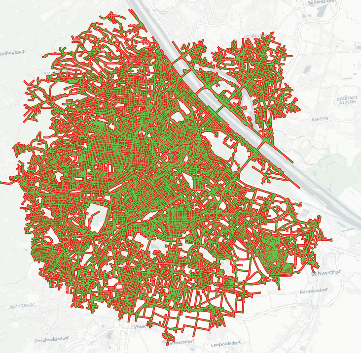

# Expansion service API reference (BETA)

Routing algorithms find the best path by _expanding_ their search from start nodes/edges across the routing network until the destination is reached (unidirectional) or both search branches meet (bidirectional). This service could be subject to change in terms of API until we remove the BETA label.

The expansion service wraps the `route` and `isochrone` services and returns a GeoJSON with all network edges (way segments) the underlying routing algorithm visited during the expansion with relevant properties for each edge (e.g. `duration` & `distance`). A top-level `algorithm` propertry informs about the used algorithm: unidirectional & bidirectional A* (for `route`) and unidirectional Dijkstra (for `isochrone`).

**Note**, for even moderately long routes or isochrones the `/expansion` action can produce gigantic GeoJSON responses of 10s of MB.



## Inputs of the Expansion service

Since this service wraps other services, the request format mostly follows the ones of the [route](../turn-by-turn/api-reference.md#inputs-of-a-route) and [isochrone](../isochrone/api-reference.md#inputs-of-the-isochrone-service). Additionally, it accepts the following parameters:

| Parameter                         | Description                           |
|:----------------------------------| :------------------------------------ |
| `action` (required)               | The service whose expansion should be tracked. Currently one of `route` or `isochrone`. | 
| `skip_opposites` (optional)       | If set to `true` the output won't contain an edge's opposing edge. Opposing edges can be thought of as both directions of one road segment. Of the two, we discard the directional edge with higher cost and keep the one with less cost. Default false. | 
| `expansion_properties` (optional) | A JSON array of strings of the GeoJSON property keys you'd like to have in the response. One or multiple of "durations", "distances", "costs", "edge_ids", "statuses". **Note**, that each additional property will increase the output size by minimum ~ 25%. By default an empty `properties` object is returned. |

The `expansion_properties` choices are as follows:

| Property   | Description                           |
| :--------- | :------------------------------------ |
| `distances`   | Returns the accumulated distance in meters for each edge in order of graph traversal. | 
| `durations`   | Returns the accumulated duration in seconds for each edge in order of graph traversal. | 
| `costs`       | Returns the accumulated cost for each edge in order of graph traversal. | 
| `edge_ids`   | Returns the internal edge IDs for each edge in order of graph traversal. Mostly interesting for debugging. | 
| `statuses`   | Returns the edge states for each edge in order of graph traversal. Mostly interesting for debugging. Can be one of "r" (reached), "s" (settled), "c" (connected). |

An example request is:

```
{"expansion_properties":["distances", "durations", "costs"],"contours":[{"time":1.0}],"locations":[{"lon":0.00026949361342338066,"lat":-0.00017966240895360996}],"costing":"auto","action":"isochrone"}
```

## Outputs of the Expansion service

In the service response, the expanded way segments are returned as [GeoJSON](http://geojson.org/). The geometry is a single `MultiLineString` with each `LineString` representing one way segment (edge). Due to the verbosity of the GeoJSON format, single geometry features would produce prohibitively huge responses. However, that also means that the `properties` contain arrays of the tracked attributes, where the indices are correlating to the `coordinates` array, i.e. the 3rd element in a `properties` array will correspond to the 3rd `LineString` in the `MultiLineString` geometry.

The output will only contain the `properties` which were specified in the `expansion_properties` request array. If the parameter was omitted in the request, the output will contain an empty `properties` object.

An example response for `"action": "isochrone"` is:

```
{"properties":{"algorithm":"unidirectional_dijkstra"},"type":"FeatureCollection","features":[{"type":"Feature","geometry":{"type":"MultiLineString","coordinates":[[[0.00027,-0.00017],[0.00027,0.0]],[[0.00027,-0.00017],[0.00027,-0.00035]],[[0.00027,-0.00035],[0.00027,-0.00017]],[[0.00027,0.0],[0.00027,-0.00017]],[[0.00027,-0.00017],[0.00053,-0.00017]],[[0.00027,-0.00017],[0.0,-0.00017]],[[0.0,-0.00017],[0.00027,-0.00017]],[[0.00053,-0.00017],[0.0008,-0.00017]],[[0.0008,-0.00017],[0.00053,-0.00017]],[[0.00053,-0.00017],[0.00027,-0.00017]],[[0.00053,-0.00017],[0.0008,0.0]]]},"properties":{"distances":[20,20,40,40,30,30,60,60,90,120,80],"durations":[0,0,29,29,1,1,30,2,31,33,5],"costs":[0,0,1,1,1,1,2,2,3,4,11]}}]}
```

## Credits

The image includes data from [OpenStreetMap](http://www.openstreetmap.org/) and the ["Positron" basemap by Carto](https://carto.com/help/building-maps/basemap-list/#positron-with-labels).
