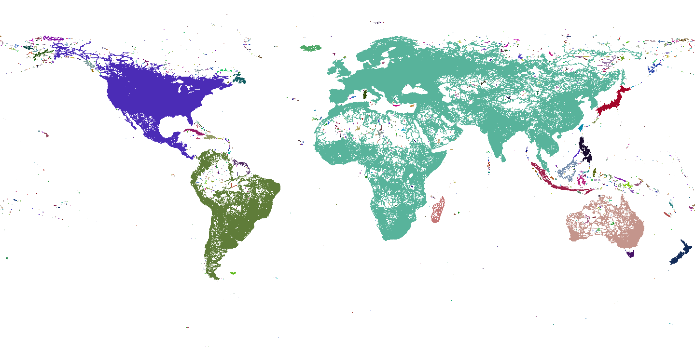

## OSM Routing Connectivity Map

In our work on open source routing, the Valhalla team at Mapzen have found an interesting byproduct of producing routing tiles - they provide a rough, first order approximation of connectivity. Valhalla graph tiles are a uniformly sampled grid in latitude, longitude space. A Valhalla graph tile exists wherever there are navigable ways. Conversely no graph tile exists if there are no navigable ways within a given tile's region. Imagine each tile in the grid were a pixel in an image. We have indeed used these tiles to create an image, in which same "colored" regions (tiles) are connected by OSM ways. Note that any uncolored region (white in the image) is deemed unreachable via Valhalla's various modes of transportation.

####Steps to Produce the Connectivity Map

Using just the files that contain the Valhalla graph data we can create the connectivity image using a simple flood fill algorithm:

1. Iterate through tiles on disk to figure out which exist placing each into a hash map as the key with an initial color of white (meaning uncolored tile)
2. Iterate over the entries in the map
  * If this entry is uncolored
    * Select a new color and create a queue of just the tile in this entry
    * While the queue is not empty
      * Pop a tile off the queue
      * Color it and add any of its neighbors to the queue who appear in the map
3. Iterate over all the tiles in the world to create an image in PPM (Portable Pixel Map) format, use white for any tiles that are not in the map
4. Convert the PPM image into png using ImageMagik
5. Flip the image vertically (Valhalla tiles are row ordered from South to North).

####GeoJSON

For all you geo hackers out there, we also provide a [connectivity map in geojson format](https://s3.amazonaws.com/mapzen.valhalla/prod/connectivity.geojson). The colors in the geojson feature properties are simply integers so you'll want to do something on your own to get a proper color out of that for rendering.

####Using the Connectivity Map

The connectivity map has one very important use within Valhalla - we are instantaneuosly able to reject routes that have no possible connection. If any 2 locations lie in tiles of different "colors" (or if either one white) in the connectivity map, then they have no possible path between them over navigable ways. A quick image lookup allows us to efficiently filter these impossible paths. Note that just because 2 locations have the same color does not mean they are guaranteed to have a valid, connecting path.

The connectivity map may also be useful to the OSM community to identify regions where no connectivity exists but perhaps should exist. This may allow focused efforts to map regions to improve connectivity.

####Dealing with Ferries and Long Ways

Valhalla stores routing data in tiles where there are nodes that intersect more than one OSM way or are endpoints of an OSM way. Some OSM ways may be long and have no intersecting ways along the path (e.g. ferries). Normally this would result in no Valhalla tiles along that path. Without special processing these long ways would create a connectivity map that falsely shows no connectivity between the endpoints of the way. To get around this, we create empty graph tiles (no nodes or edges) to indicate there is connectivity through the tile's region.

