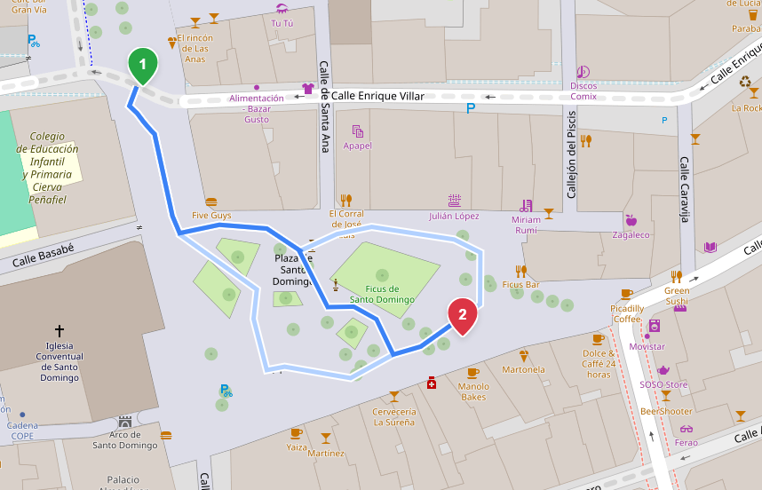

# Pedestrian areas

Valhalla supports routing through pedestrian areas such as: squares, plazas and pedestrian zones mapped as polygons or multipolygons, instead of only routing around their perimeter. It does this by building a traversal skeleton along each area's medial axis and connecting it to the surrounding pedestrian network, so a route can cross a square the way a pedestrian actually would.

The feature is enabled with the `mjolnir.pedestrian_areas` config option and is **off by default**, so it has no effect on existing tile builds unless explicitly turned on.



The example above is [Plaza de Santo Domingo](https://www.openstreetmap.org/relation/1525621) in Murcia, Spain.

## Enabling it

Set the option in your config, or pass it when generating one:

```json
{
  "mjolnir": {
    "pedestrian_areas": true
  }
}
```

The feature generates traversals for pedestrian ways, so it also depends on `mjolnir.include_pedestrian`. That option is enabled by default, so no extra configuration is normally needed, but if you have explicitly disabled it, `pedestrian_areas` will have no effect.

Tiles then need to be rebuilt for the change to take effect.

## What counts as a pedestrian area

An area is picked up based on how its [tags are parsed](../contributing/architecture/mjolnir/tag-parsing.md):

- a closed way with `highway=pedestrian` and `area=yes`
- a relation with `type=multipolygon` and carrying the same pedestrian tagging as the closed way, whose member ways form the outer boundary (and any inner rings)

Inner rings are treated as holes, so obstacles inside the area like a fountain, a building, or a monument are routed around if they are mapped as such.

## How it works

Processing happens in two stages of Valhalla's tile builder, [Mjolnir](../contributing/architecture/mjolnir/index.md).

### Recovering the geometry

Areas mapped as relations have member ways with no routable tags of their own, so the regular way parsing discards them. A dedicated pass in the stage `kParseAreaWays` recovers exactly the ways referenced by the collected area relations and marks them with the area bit, so their geometry survives to the builder without being turned into edges.

### Building the traversal

For each area, the builder in the stage `kBuildAreas`:

1. Assembles the polygon(s) from the member ways, including any holes.
2. Densifies the boundary and computes a Voronoi diagram of the resulting points, keeping only the edges that fall inside the polygon. This approximates the medial axis, the skeleton running down the middle of the shape.
3. Prunes the branches that reach out toward the corners.
4. Connects each entrance (a perimeter node shared with a pedestrian way) to the nearest skeleton vertex it can reach in a straight line without leaving the area.
5. Materialises the result as synthetic footways.

These synthetic ways carry ids above the highest real OSM way and node ids, so they never collide with real data, and are otherwise handled by the rest of the pipeline like any other footway.

## Design decisions

A few decisions that keep the feature robust on the majority of areas:

- **Small areas keep their perimeter.** Areas below a size threshold are not worth a generated traversal, so their perimeter is made routable instead.
- **Areas that are already routable are left alone.** If a pedestrian way already runs through an area, no skeleton is generated on top of it.
- **Nearby entrances are merged.** Entrances that sit close together and can see each other through the area are grouped, so several footways arriving at the same corner don't each get their own connection.

## Configuration reference

| Option | Type | Default | Description |
| :----- | :--- | :------ | :---------- |
| `mjolnir.pedestrian_areas` | bool | `false` | Generate routable traversals through pedestrian areas. Has no effect unless `include_pedestrian` is also enabled. |
| `mjolnir.include_pedestrian` | bool | `true` | Whether pedestrian ways are included in the graph. Enabled by default and required for `pedestrian_areas` to take effect. |
