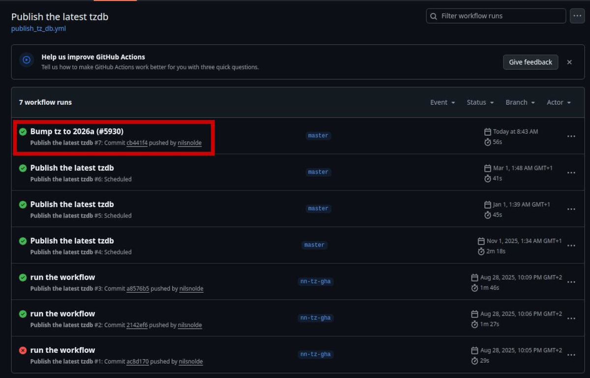
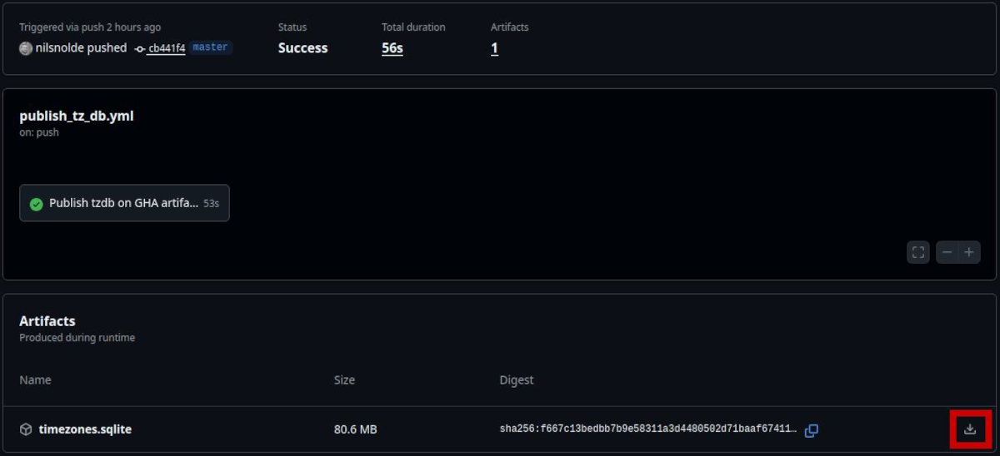

# Getting started

This guide shows some of the main features of Valhalla routing engine. We'll see how to generate the data, run the routing engine on our machine and make some requests.

We assume basic familiarity with the command line and the installation method of your choice.

## Install

=== "Docker"

    The simplest way to install Valhalla and its tools is with [Docker](https://www.docker.com/). We'll use the [official _base_ image](https://github.com/valhalla/valhalla/pkgs/container/valhalla):

    ```bash
    docker pull ghcr.io/valhalla/valhalla:latest
    ```

    Now we can start the container:

    ```bash
    docker run \
        --name valhalla \
        --publish 127.0.0.1:8002:8002 \
        --mount type=volume,src=valhalla-data,dst=/data \
        --workdir /data \
        --interactive \
        --tty \
        --rm \
        ghcr.io/valhalla/valhalla:latest
    ```

    In addition, this command:

    - Publishes a port so we could communicate from outside the container.
    - Creates a volume named `valhalla-data` and mounts it at `/data` directory inside the container to persist generated files.

    From now on, we'll run all commands _inside_ the container, in `/data` directory with a mounted volume.

    Finally, update the list of available software packages and install some helpful programs:

    ```bash
    apt update
    apt install jq less tree wget
    ```

=== "Python"

    Valhalla is available on [PyPI](https://pypi.org/project/pyvalhalla/):

    ```bash
    pip install pyvalhalla
    ```

    It comes with some tools (C++ executables) which we need. To run them, you could either execute the module:

    ```bash
    python -m valhalla valhalla_build_tiles --version
    ```

    or use the wrapper script directly:

    ```bash
    valhalla_build_tiles --version
    ```

    We'll use the second form in this guide to keep it short. If you have any problems, take a look at [Python bindings](installation/python.md) page.

---

Let's make sure that everything is okay - the following command should return the version:

```console
$ valhalla_build_tiles --version
3.6.3
```

Tools are simply programs which help us do different things. All Valhalla tools support `--help` option to show the usage.

## Configuration file

All Valhalla tools use a common JSON configuration file. It contains settings for data generation, location search, service process and so on.

Let's create it:

```bash
# For Python, use the following command instead (same options)
# python -m valhalla.valhalla_build_config

valhalla_build_config \
    --mjolnir-admin "${PWD}"/admin.sqlite \
    --mjolnir-timezone "${PWD}"/timezones.sqlite \
    --mjolnir-tile-dir "${PWD}"/tiles/ \
    --mjolnir-tile-extract "${PWD}"/tiles.tar \
    > config.json
```

Options override default paths to some files and directories - we'll see them later.

The command generates a configuration with reasonable defaults. Take a look:

```bash
less config.json
```

## Prepare the data

Valhalla needs some data in order to work.

The fundamental component is a set of [**routing tiles**](tiles.md) - a directory of files in a specific format with information about the roads, restrictions and so on.

The main data source for this is [OpenStreetMap](https://www.openstreetmap.org/) (OSM): Valhalla takes OSM map data in [PBF format](https://wiki.openstreetmap.org/wiki/PBF_Format) and uses it to create a set of tiles.

> To learn more about OSM, see [Beginners' Guide](https://wiki.openstreetmap.org/wiki/Beginners%27_guide) and [Downloading data](https://wiki.openstreetmap.org/wiki/Downloading_data).

Here's what we need to do:

1. Download [OSM data extract](https://download.geofabrik.de/technical.html) in `.osm.pbf` file format.
1. Build _admins_ database.
1. Download _time zones_ database.
1. Build routing tiles.

### Download OpenStreetMap data extract

We can use [Geofabrik's free server](https://download.geofabrik.de/) to download a [data extract](https://download.geofabrik.de/technical.html) to `osm/` directory:

```bash
wget --directory-prefix osm/ \
    https://download.geofabrik.de/europe/andorra-latest.osm.pbf
```

!!! warning

    Valhalla can work with multiple data extracts, but this is discouraged. See [Issue 3925](https://github.com/valhalla/valhalla/issues/3925).

### Build admins database

Admins database has information about administrative boundaries: country borders and so on. Valhalla uses this to flag country crossings and figure out on which side of the road to drive - left or right.

```bash
valhalla_build_admins -c config.json andorra-latest.osm.pbf
```

We'll see some warnings and errors in the logs:

```text
2026-03-08 09:24:08.911757938 [WARN] Catalunya (349053) is missing way member 1415938360
2026-03-08 09:24:08.911786366 [WARN] Catalunya (349053) is degenerate and will be skipped

...

2026-03-08 09:24:08.915498329 [ERROR] sqlite3_step() error: NOT NULL constraint failed: admin_access.admin_id.  Ignore if not using a planet extract or check if there was a name change for Cymru / Wales
```

It's safe to ignore them for now as we use a regional PBF extract, not the whole planet.

!!! info

    For production, use the whole planet. TODO Why?

### Download time zones database

Valhalla uses time zones to enable proper arrival and departure times and time zone metadata in route results.

There's a [GitHub workflow](https://github.com/valhalla/valhalla/actions/workflows/publish_tz_db.yml) which builds time zones database for the whole planet and publishes it as an artifact available for download. To get the latest file, follow the link, select the latest run and download the SQLite database file to the working directory.

{ width="600" }

{ width="600" }

### Build routing tiles

Finally, we are ready to build the tiles:

```bash
valhalla_build_tiles -c config.json osm/andorra-latest.osm.pbf
```

We'll see a bunch of log messages. If you see the following warnings, make sure that you have correct path in configuration file:

```text
2026-03-08 10:06:29.361219214 [WARN] Time zone db /data/tz_world.sqlite not found. Not saving time zone information.
```

Once finished, we can see generated data in `tiles/` directory (the one from configuration file). At the time of writing it looks like this:

```console
$ tree tiles/
tiles/
|-- 0
|   `-- 003
|       `-- 015.gph
|-- 1
|   `-- 047
|       `-- 701.gph
`-- 2
    `-- 000
        |-- 762
        |   |-- 485.gph
        |   `-- 486.gph
        `-- 763
            |-- 925.gph
            |-- 926.gph
            `-- 927.gph

9 directories, 7 files
```

At last, we combine all tiles into a single tar archive file:

```bash
find tiles/ | sort -n | tar --create --file tiles.tar --no-recursion --files-from=-
```

Valhalla can [memory-map](https://en.wikipedia.org/wiki/Memory-mapped_file) this archive file to efficiently cache it and share between multiple processes.

## Start the service

There are multiple ways to run Valhalla. The most common is via the simple HTTP service:

```bash
valhalla_service config.json 1
```

Valhalla service is an HTTP server process - it accepts requests and returns responses. By default, it is available on port `8002`, but we could change that in the configuration file.

> If you used Docker and published the port, you can send requests to Valhalla using <http://localhost:8002> address from outside the container.

Let's check the status:

```console
$ curl http://localhost:8002/status | jq '.'
{
  "version": "3.6.3",
  "tileset_last_modified": 1772753449,
  "available_actions": [
    "tile",
    "status",
    "centroid",
    "expansion",
    "transit_available",
    "trace_attributes",
    "trace_route",
    "isochrone",
    "optimized_route",
    "sources_to_targets",
    "height",
    "route",
    "locate"
  ]
}
```

Public API is RESTful - there's set of paths (`/status`, `/route`, etc) for different operations, each accepts either GET or POST requests. For both, we can pass the content either via query parameter or as a body with JSON content. Formats depend on the specific operation.

> We use `curl`, but you could use any other CLI tool (httpie, etc) or API client (Bruno, etc) to talk to the service.

## Use the API / features

!!! note

    Work in progress...

!!! tip

    Use [demo web application](https://valhalla.openstreetmap.de) to explore and experiment with Valhalla service.

    Additionally, demo server provides a [web API](https://en.wikipedia.org/wiki/Web_API) at [valhalla1.openstreetmap.de](https://valhalla1.openstreetmap.de).

> TODO: Pedestrian route: [Casa de la Vall](https://en.wikipedia.org/wiki/Casa_de_la_Vall) > [La Noblesse du Temps](https://www.atlasobscura.com/places/the-nobility-of-time) statue.

> TODO Auto route: [Andorra la Vella](https://en.wikipedia.org/wiki/Andorra_la_Vella) city > [Pont Tibetà de Canillo](https://www.ponttibetacanillo.com/).

Basic _route_ request (auto):

- Locations
- Costing
- Other options

Response sample, visualize response polyline with [polyline visualization tool](https://valhalla.github.io/demos/polyline/).

Couple more requests with other _costing modes_ - pedestrian, bike.

Other _services_ - isochrone, map-matching, matrix?

Check the logs.

## Continue reading

- Check out [API reference](api/index.md) for a complete overview of all features - routing, map matching, isochrones, etc.
- _Installation_ section has different ways about how to install Valhalla.
- [Configuration guide](guides/configuration.md) has detailed information about how to configure tools and services.
- See [Data guide](guides/data.md) for more details about the data, additional sources, traffic, public transit and so on.
- [Operations guide](guides/operations.md) has advice on how to run the service.
