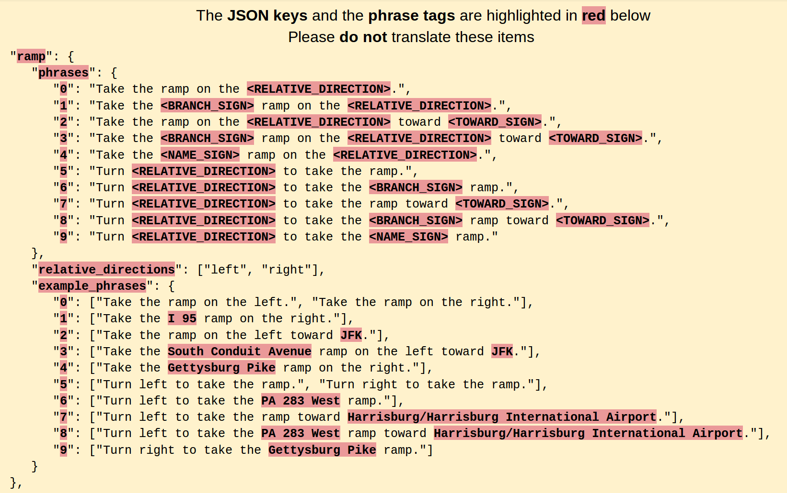

# Narrative language files

Valhalla supports localized instructions in multiple languages for both textual and verbal phrases. All localized text is managed in JSON files in the [locales](https://github.com/valhalla/valhalla/tree/master/locales) directory. We rely on external contributors to provide translations of these phrases to other languages.

## Contributing translations

The recommended way to contribute translations is on [Transifex](https://www.transifex.com/). If you prefer you may also skip Transifex and edit the language files directly.

### Translating on Transifex (Recommended)

Follow these steps to start contributing a translation:

1. Sign up for a free account at https://www.transifex.com/.
2. Navigate to https://www.transifex.com/explore/projects/ and search for the `Valhalla Phrases` project.
3. Submit a request to join the team for the languages you know. You may also request a new language if yours does not appear in the list.
4. Wait for an email with an invitation to start translating.
5. From the [dashboard](https://www.transifex.com/valhalla/valhalla-phrases/dashboard/), navigate to the Translate page for your chosen language.
6. Select the `en-US.json` source file to translate from.
7. Before you start translating make sure to filter out any phrases with the `notranslate` tag. Apply this filter by selecting Tag > Doesn't contain tag > notranslate.
8. For more information on how to use Transifex, check out the [getting started guide](https://docs.transifex.com/getting-started-1/translators).

Once a language is 100% translated, the project maintainers will be notified and we will make a PR with your updates. Thank you for your contribution!

### Translating language files directly (Advanced)

Follow these instructions if you prefer to edit the JSON files directly without Transifex.

#### How to contribute a new narrative language file

1. Copy the `en-US.json` to `<NEW_LANGUAGE_TAG>.json`
Using [IETF BCP 47](https://tools.ietf.org/html/bcp47) as reference - the typical format for the `<NEW_LANGUAGE_TAG>` is:
<[ISO 639 two-letter language code](https://en.wikipedia.org/wiki/List_of_ISO_639-1_codes)>-<[ISO 3166 two-letter country code](https://en.wikipedia.org/wiki/ISO_3166-1_alpha-2)>
Czech/Czech Republic example:
`cs-CZ`

2. Update the `posix_locale` value in your new file. The character encoding must be UTF-8. The typical format is:
<[ISO 639 two-letter language code](https://en.wikipedia.org/wiki/List_of_ISO_639-1_codes)>_<[ISO 3166 two-letter country code](https://en.wikipedia.org/wiki/ISO_3166-1_alpha-2)>.UTF-8
Czech/Czech Republic `posix_locale` example:
`cs_CZ.UTF-8`

3. Update the `aliases` array in your new file. A typical alias entry is the [ISO 639 two-letter language code](https://en.wikipedia.org/wiki/List_of_ISO_639-1_codes) without the
[ISO 3166 two-letter country code](https://en.wikipedia.org/wiki/ISO_3166-1_alpha-2). The alias entry must be unique across language files.
Czech `aliases` entry example:
`cs`

4. Do not translate the JSON keys or phrase tags. An example using the ramp instruction:


5. Please translate the JSON values. As needed, reorder the phrase words and tags - the tags must remain in the phrase. An example using the ramp instruction:


6. Run `make check` to verify the tests pass OR move on to step#7 and we can help verify.

7. Submit a pull request for review. Thank you!

#### Adding new instruction strings

TODO(nils): I don't think that's how it's supposed to work (anymore?). If I understand correctly, we'd upload a new `en_US.json` to Transifex and that'll take care of copying the new stuff to existing translation files.

1. First add the new strings in en-US.json. The JSON keys are used by narrative_builder to select the instruction template string.

2. Sync the new strings to each new narrative language file by running `./merge-en.sh`. This will copy the new English strings to each new language.

3. Update the English strings in each language file.

#### Instruction descriptions
`TODO`

#### Tag descriptions
`TODO`

# Syncing with Transifex

Use the [Transifex command line client, `tx`](https://docs.transifex.com/client/introduction), to sync locale files with the Transifex website.

## Install

* [Install tx](https://docs.transifex.com/client/installing-the-client).
* Get an API secret from [your settings page](https://www.transifex.com/user/settings/api/).
* Run `tx status` in the root valhalla directory to confirm.

## One-time setup

These were the steps taken to setup tx for the first time, you can probably just skip to the next section.

* Run `tx init` in the root directory. This will walk you through creating the `.tx/config` file.
* Use `locales/en-US.json` as the path to the source file.
* Use `locales/<lang>.json` as the path to the translation files.
* Use `Valhalla` as the Organization name and `Valhalla Phrases` as the project name.

To learn more about the Config command, visit https://docs.transifex.com/client/config.

## Useful commands

### Pulling translation updates from Transifex

Pull acceptable translation files with 16 threads using `git` timestamps (else it'll use filesystem timestamps which seems completely wrong):

```
tx pull --minimum-perc 70 --workers 16 --use-git-timestamps
```

Use this command to pull all changes from Transifex into the Valhalla repo (will contain the ones not > 70%).

```
tx pull --all
```

Or for just one language (use --force to overwrite local):

```
tx pull --language <lang> --force
```

### Pulling English source file updates from Transifex

When the source file en-US.json has been updated on Transifex manually.

```
tx pull --source
```

### Pushing translation updates to Transifex

When edits have been made to the locale JSON files manually in git but not in Transifex.

NOTE: this command will overwrite the file on Transifex, you will want to pull updates first and resolve any conflicts.

```
tx pull --all
# resolve conflicts, open PR
tx push --all
```

### Pulling NEW translation file FROM Transifex

Translation files for new languages that are contributed in Transifex are not automatically downloaded by tx:

1. Pull the new language:
    ```
    tx pull --language <lang>
    ```
2. Make sure the new translation filename is following the <lng-REGION.json> convention.
3. Update `./.tx/config` with the new translation file mapping.
4. Update [`test/gurka/test_route_with_narrative_languages::lang_phrase`](https://github.com/valhalla/valhalla/blob/da0a0720b04491d769ff5ce861fc82f0a172a87e/test/gurka/test_route_with_narrative_languages.cc#L51) vector with the new phrase (best let if fail after updating it a bogus phrase which will print the correct one)

### Pushing NEW translation file TO Transifex

New language files added in Valhalla need to be uploaded to Transifex for external contributors to make updates in the translation interface. Make sure that language does not already have a translation file in Transifex first by trying a pull command.

```
tx pull --language <lang>
# if no translation exists push up a new one
tx push --language <lang> --translations
```
