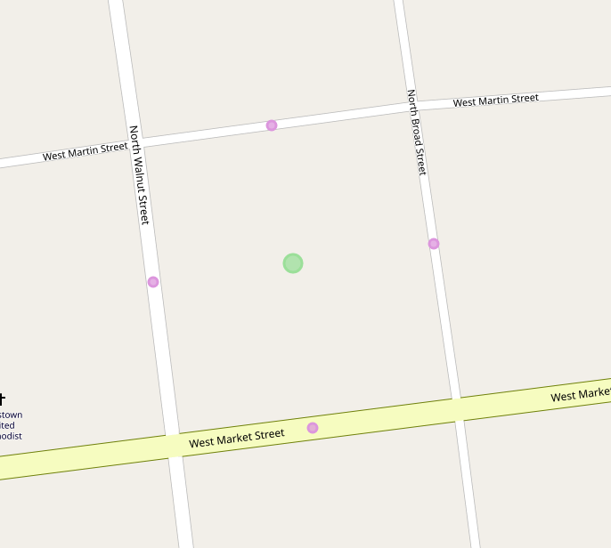
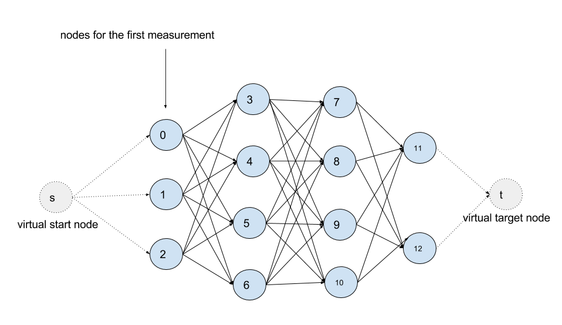

# Overview

Meili is a namespace within valhalla which is responsible for providing map matching functionality in the library. This scope of this functionality is essentially limited to the approach defined in the siminole microsoft paper outlining the technique: https://www.microsoft.com/en-us/research/publication/hidden-markov-map-matching-noise-sparseness/

The important thing to note here is that Meili is not responsible for packaging the results of the map match into a route path as defined in our primary routing module Thor. Thus there is a non-trivial amount of effort to take the output of Meili and convert it to the expected format.

# Meili Code Layout

## AppendMeasurements

The first step Meili does is decide which tracepoints its going to map match. You might think that it map matches every point (and it does) but it doesnt actually do the routing computation using every point if it can avoid it. We allow specifying an interpolation distance which groups close together points such that only one will be used and the rest will be interpolated onto the map match after it is performed. This not only speeds up the code but it also avoids problems with GPS jitter of stationary objects. This work is done in the function `AppendMeasurements` which append tracepoints into what can be thought of as a matrix.

Whats in this matrix? For every input point that `AppendMeasurements` decides it will use in the routing calculations a column is made in the matrix. Each column can have 1 or more rows but they will not all have the same number of rows. Each row represents an edge candidate for a given trace point. An edge candidate is a snap point along an edge in the graph within the radius of the input trace point.

The above is an image of the 4 magenta edge candidates for an input trace point with a 50m radius. `AppendMeasurements` eventually calls down into `CandidateQuery::Query` to get the list of candidates for a given trace point. It should be noted that `CandidateQuery` provides the same functionality `Loki::Search` does however there are some key differences. The main difference is that `CandidateQuery` keeps a fine resolution in-memory spatial index/cache of route network geometries. What this means is that it can have much higher throughput (once the cache is warm) than loki for high numbers of points. This is a key difference between map matching and routing use-cases. In routing we dont expect 1000s of way points but GPS traces are frequently reported at 1hz. Which means a 15 minute trace is already close to 1000 points. In the future we'd like to remove `CandidateQuery` and replace it with functionality from `Loki::Search` but at this time performance considerations keep us from doing so.

## Viterbi

Viterbi is a dynamic programming algorithm used to find paths (eg. Markov chains) through a hidden state diagram such as a hidden Markov model. Read more about it here: https://en.wikipedia.org/wiki/Viterbi_algorithm. Within Meili we use the algorithm to determine the highest probability map match while doing the least number of routing calculations possible. You can think of the matrix described above as a series of nodes in a state diagram. Each row in each column has a connection to each row in the previous and next column in the diagram. We refer to these unique column/row pairs as `State`s through out the code and each is given a `StateId` which represents which column (0..n) and which candidate (0..m) it refers to. In the figure below candidates 0 1 and 2 are in column 0 whereas candidates 3, 4, 5 and 6 are in column 1.

`ViterbiSearch` is run by iterating over pairs of columns and running routes between their candidates (rows). While doing so we measure two metrics, emission and transition cost. These costs are inversely related to the probabilities in the hidden markov model. Emmission cost is simply a measure of how close to the road network a given candidate is where as transition cost is a function of network distance along the route between two candidates in the graph.

At the end of the viterbi search a highest probability (lowest cost) path, ie a sequence of `StateId`s, is returned. There may or may not be sections of the path where no route was possible between a given pair of `State`s or even between columns (all pairs of candidates in 2 adjacent columns).

## Match Points

After a path through the state diagram as been computed we need to get the first part of the output from Meili which is to say which candidates were used in the final path. To do that we call `FindMatchResults` which loops over the states and an returns a vector of `MatchResult` objects. The `MatchResult` contains information about which edge it matched to, what the lat,lon is once snapped to the edge, the distance along the edge as a percentage among other things. This is useful because the final service APIs mapmatching output contains this metadata, either indirectly via a origin/destination location or directly in trace_attributes or the osrm flavored output.

## Interpolation

The `MatchResult`s that we got back only included those points which `AppendMeasurements` deemed necessary for the routing calculation. That means that for some of the input points, as mentioned earlier, we didnt actually attach a column to them or any states. This is kind of what it looks like in an ascii diagram:

    p1p2------p3-------p4p5p6-----------p7--------------p8-----------p9p10

In the above `{p2, p5, p6, p9}` are all interpolated because they are close in distance to a prior point or in `p9`s case close to the last point which cannot be interpolated. So what we do next is we loop over pairs of states again and if between those two states there were unused (ie interpolated) input points then we project each of those points in succession onto the route between them. Using the example above, if we found a route between p4 and p7, then we would project p5 and p6 onto this route geometry to compute their `MatchResults`. Interpolation also guarantees that sequence ordering remains unchanged, ie p4 comes before p5 comes before p6 comes before p7 in the final route geometry.

## Route Building

Next we get the second part of Meil's output which is the actual path through the graph that was taken. We compute this with a call to `ConstructRoute`. Construct route uses the `States` to get at sequences of edges stored as a collection of `EdgeLabel`s in a `LabelSet`. The `LabelSet` contains all the edge labels a graph expansion saw. For a given `State` we know which was the last label it saw when it reached the destination `State`. So to get the route out we simply follow the chain of `EdgeLabel`s back to the origin `State`. Its like a linkedlist but without pointers, instead it uses indices into the `LabelSet`. The `MergeRoute` function is responsible for this recovery of a path between two states.

From these `EdgeLabels` we make a vector of `EdgeSegment` objects, which is the final object that is returned. The `EdgeSegment` stores information about which edge in the graph it is, how much of it was used and what was the first and last `MatchResult` that got matched onto this `EdgeSegment`. It also contains information about whether or not there is a discontinuity after this `EdgeSegment`. As described before a discontinuity occurs when no paths for any candidates can be found from between two columns.

During this process we also take care to cut `EdgeSegment`s where a `MatchResult` is marked as a `break` or `break_through` location. These types of locations denote where we want to have route legs in the final output. So that we don't have to break them down later in serialization, we make sure to split edges when constructing the route.

## Alternatives

Meili supports the notion of alternatives. The API calls this "best_paths" but should be refactored to use "alternatives". What this allows a user to do is get the `top k` most probable paths with a couple caveats.

The first caveat is that if there is a discontinuity in one of the results we will not return any more results after that. So if the first match had a discontinuity you'll only get 1 result even if you asked for 2.

The second caveat is that redundant paths are not returned. What is a redundant path? Its a path that has already been seen in a previous result. Technically this means that the sequence of `EdgeSegments` has already been seen. Why would this happen? It is common that a `MatchResult` has two candidates, but no matter which one is used, the sequence of edges in the path remains the same. Basically the `MatchResults` may move around but the path is the same. This commonly occurs at intersections where one candidate may be some distance along the edge and the alternative candidate will be at the end of the previous edge. Either way both edges are on the path, the path didn't materially change.

## Complications

The biggest complication in map matching by far is that of dealing with node snapped candidates. That is to say when an input trace points closest point on the graph is a node in the graph connecting 2 or more edges. This type of candidate presents 2 problems. The first is one of performance. You could say, no problem we'll just put a candidate for every edge at that node, but this is very wasteful as each candidate added increases the number of permutations of routes that viterbi will cause to be computed. So instead of doing that we have special logic in the router there handles node snapped candidates as a single candidate. The second problem with node candidates is that of ambiguity. Because a node does not refer to an edge but all of our other datastructures do (`MatchResult` and `EdgeSegment`) we end up needing to put a bunch of special case logic to patch things up if they are happening at a node. Specifically when we have a trace point that is the split between two legs in a route, we end up having the end of one leg on one edge and the beginning of the next leg on another edge and using the same `MatchResult` (which only stores one edge reference) means that it disagrees with one of the legs.

# Thor Contract

Meili itself does not have an external API. It kind of used to but has since been refactored to be accessed via the rest of our routing APIs. What this means is that it must fulfill the same contract that Thor does. That contract consists of a series of `Location`s with the chosen candidate for each `Location` getting filled out (in this case we translate the `MatchResult` into this) as well as a path which is a series of `PathInfo`s representing the edgs on the path and their cost/duration.

The bulk of what has been described about Meili above was referring to its main entry point `OfflineMatch` (offline refers to the type of algorithm, see here: https://en.wikipedia.org/wiki/Online_algorithm). Thor must take the results of this function which, as described earlier, is a series of `MatchResults` and a series of `EdgeSegments` and convert them. This conversion takes place first via `FormPath` (every path finding algorithm implements one of these) and then via a call to `TripLegBuilder::Build` for each leg of the route. `FormPath` builds the vector of `PathInfo` objects from the `EdgeSegments`. The `MatchResults` are used to build origin and destination `Location`s. The `PathInfo`s and `Location`s are then sent to `TripLegBuilder::Build` as with every other routing operation.
