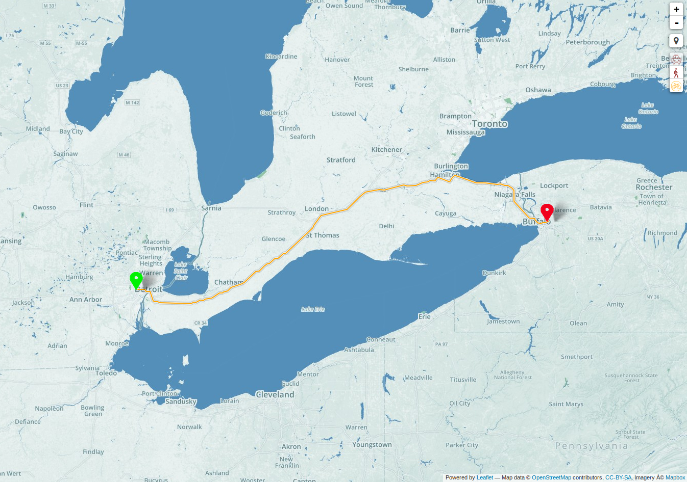
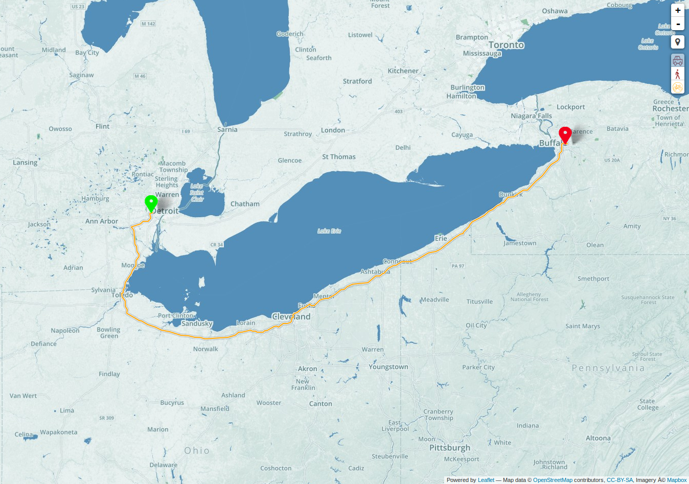

### Why is administrative attribution important?

[x] Rental Car 

[x] Laptop 

[x] Cell 

[x] Luggage 

[ ] Passport 

D’oh!  Facepalm!  I totally forgot that my passport has expired.  The fastest route from Detroit, MI to Buffalo, NY is via Canada.   For a US citizen, it is best to use a passport when driving through Canada; therefore, I must seek an alternate route.  What drives me nuts is the fact that most of the routing sites do not provide an option to avoid country crossings.  However, Valhalla does provide the ability to avoid country borders.
### Admins and Costing

[Mjolnir](https://github.com/valhalla/mjolnir) pulverizes data into a usable form.  Well, not really...It does, however, give the option to apply attribution to the Valhalla routing data.  An administrative database is created via pbfadminbuilder and can then be used to flag country crossings on edges during the building of the graph data.

Now costing comes into play…Valhalla uses dynamic, run-time costing to form the route path. (Read more about [SIF](http://github.com/valhalla/sif) and dynamic costing [in our previous blog post](https://mapzen.com/blog/dynamic-costing-via-sif).)  A route request to Valhalla includes the name of the costing model and can include optional parameters accepted by the costing mode.  In our case, we are using the Auto costing model and the optional parameters:

- country_crossing_cost = A cost that is applied when a country crossing is encountered. This cost is added to the estimated time / elapsed time. The default cost is 600 seconds.

- country_crossing_penalty = A penalty that is applied to the cost when a country crossing is encountered. This penalty can be used to create paths that avoid country crossings. The default penalty is 0.

Let’s try it out.   Running the route from Detroit, MI to Buffalo, NY takes us through Canada.  Obviously, this will not work for me as my passport has expired.

However, if I boost the country_crossing_penalty to say 25 minutes or 1500 seconds, we avoid Canada and the use of the passport for this route.

Now my trip can begin!  I started my passport renewal process and I am jumping into the car with directions that avoid country crossings.

### Administrative attribution is important.

As you can see, administrative attribution is important for avoidance.  We could set the country_crossing_penalty to a very high value to always avoid country crossings.

Valhalla will also use the administrative information for providing country and state or province information in the narrative (e.g., Crossing into New York, United States or Crossing into France).  In the future, we will also use the country ISO code to create logic in [ODIN](https://github.com/valhalla/odin) that will be used to determine the base names of streets internationally.  The base names will enable us to produce a cleaner narrative by collapsing maneuvers appropriately.

Currently, when max_speed tag is not present, Valhalla assigns a speed based on the highway tag.  There are country specific guidelines for speed limits per highway tag.  We could use these default speed limit matrices for each country in order to provide more accurate time estimation and the best route ([Maxspeed](https://wiki.openstreetmap.org/wiki/OSM_tags_for_routing/Maxspeed)).

### What’s next for admins in Valhalla?

Valhalla uses admins to determine if we drive on the right or left; however, default access restrictions per country are not assigned yet.
Can I walk on a trunk road in France?  What about in the United States?  How about in Germany?  Admins will help Valhalla create default access restrictions for each country where available ([Access-Restrictions](https://wiki.openstreetmap.org/wiki/OSM_tags_for_routing/Access-Restrictions)).
