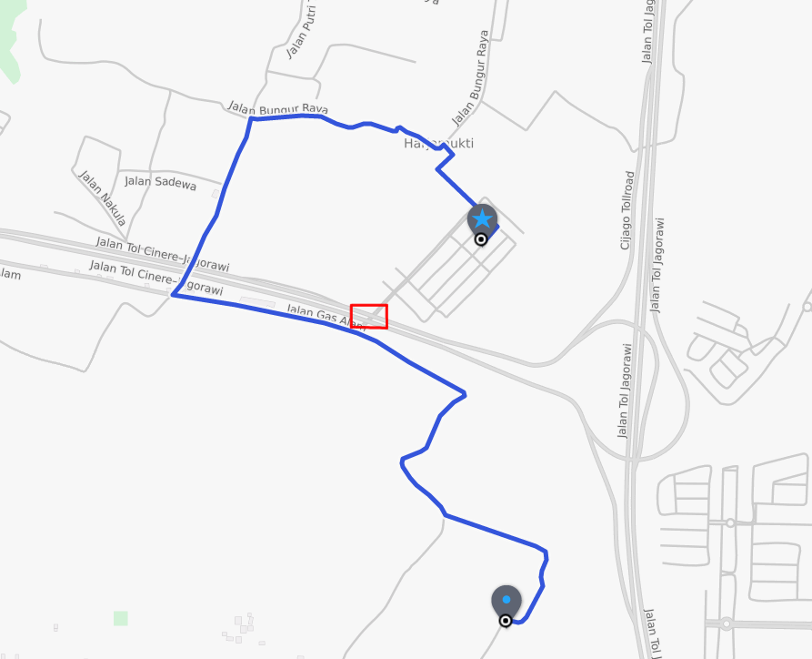
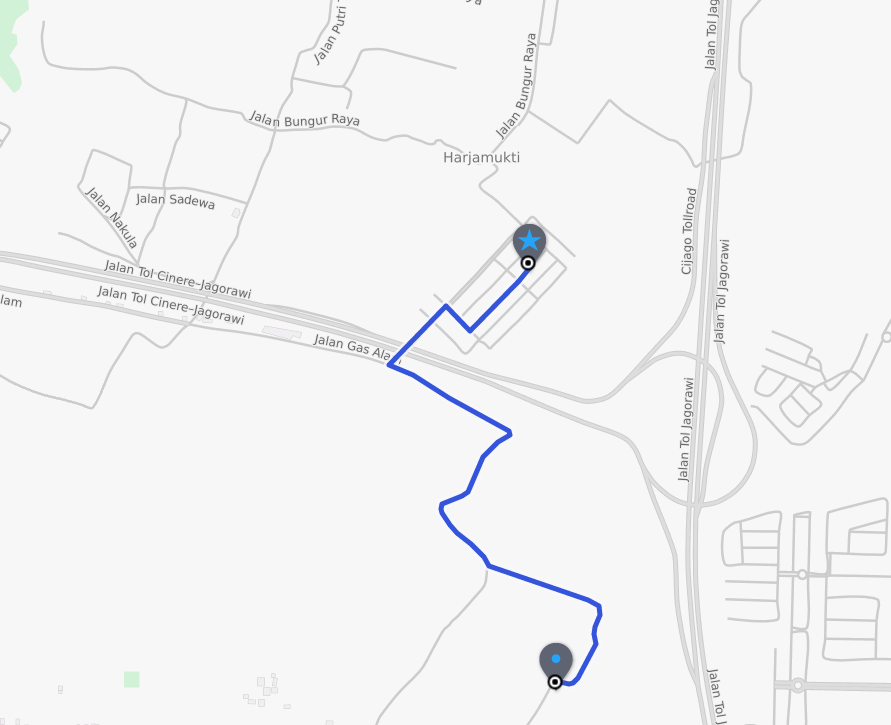

# Map Roulette and Valhalla
Not so long ago the routing team started to notice that occasionally the origin or destination of a route would be unreachable. These routes weren't anything extravagant or extraordinary, but for some reason they were failing. After some investigation we realized that certain errors in OpenStreetMap could easily cause the routes to fail. The most obvious of these seemed to be when the direction of one way roads was switched. To differentiate between routes that fail because two locations are disconnected in real life and routes that were doomed from the start by these errors, we started trying to detect them. Once we were detecting them we had to figure out what to do with them. Do we manually edit them all ourselves? Do we ignore them and hope they get fixed down the road? There could be hundreds or thousands of these types of errors in OSM that could impact routing.

To demonstrate what this might look like, here is the same route before and after an error was fixed. A one way road in the red box was reversed, causing the route to go further than needed.

Enter Map Roulette: A platform that allows contributors to submit sets of errors so that the OSM community can fix them. After we found out about this, we started working on code designed specifically to look for these errors, and once we had a collection of these errors we planned to submit them to Map Roulette. As we got closer to doing this, we realized that eliminating the errors only once would not prevent errors from being created in the future. We also thought that we could probably automate the process to minimize manual intervention in the process. To start testing this we needed the help of Martijn Van Exel, the creator of Map Roulette. He helped us get local instances of the Map Roulette server running as well as answered other questions we had along the way.

The automation process seemed like a good fit for a bit of Python. After building a few tools for testing the Map Roulette API and our collection of errors, we brought it all together to create a tool that can be run without any manual intervention. We now run this tool right after checking the latest set of tiles for errors, allowing any new errors to be automatically uploaded to Map Roulette. Additionally, the tool can also detect errors that were marked as fixed but were not fixed correctly.

The result of all this work is a framework that allows for detection, submission, and eventual resolution of OSM errors. To start doing this for a new type of error, the only thing we would need to do would be to write a detection algorithm, create a geojson representation of the error, and add the new type of error to the tool's configuration file.

Currently, we only have one type of error being detected and automatically submitted, but look forward to seeing what other issues we can fix and how much we can help improve OSM.
