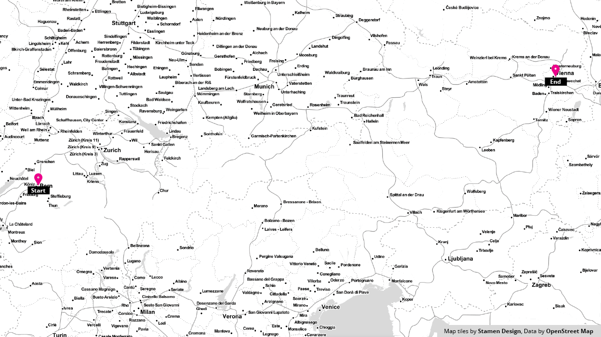

## Routing Tiles - the Who, What, When, Where, How and Why?

This GIF gives a conceptual overview of the tiles used in a resultant graph traversal and how the level of detail needed may change depending on the connectivity of the road network in a given region.

### Benefits of a tile based approach to routing:

 - **Reduced memory requirements**  a connected graph can take up a lot of space in memory. By cutting the graph into a tiled structure you more easily impose limits on how much of the graph resides in memory at any one time. This could enable on device routing capabilities on even the most meager of hardware which could improve access to those in developing regions.

 - **Cacheability** 

 - **Updateability**  updates to the graph could be highly parallelized simply because the graph is already broken up into a tiled structure. Faster turn around times on edits would be spectacular.

 - **Regional Extracts and Off-line Routing**  you're headed to Switzerland for vacation and you don't want to pony up the Francs to get a SIM card? Before you go, or while you're on wifi, download an extract of the region. Afterall it's only 100mb or so.

 - **Return to Route**  most phone based navigation applications require contacting a server when a user deviates from the specified route path, even for common cases like stopping for fuel or food. With graph tiles downloaded along the route path, the navigation application can find a path back to the route without an expensive call to the routing server. 
 
 - **Enhanced Navigation** tiles along the route allow more detailed information to be presented along the route without having to increase the payload in the initial call to the routing service. Exits along the highway, names of upcoming roads, and other information can be presented when graph tiles are present.

We're excited with what we've accomplished so far, and look forward to showing you more soon. We plan to launch an open routing service as well as downloadable tiles later in the year.
