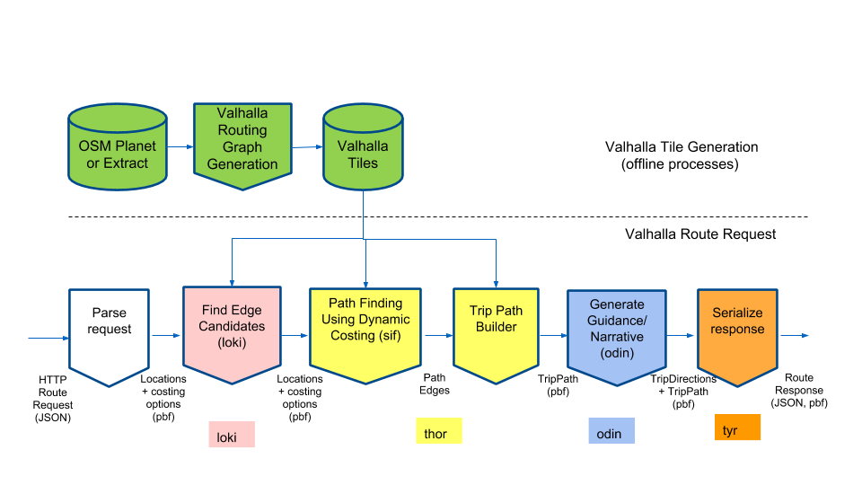
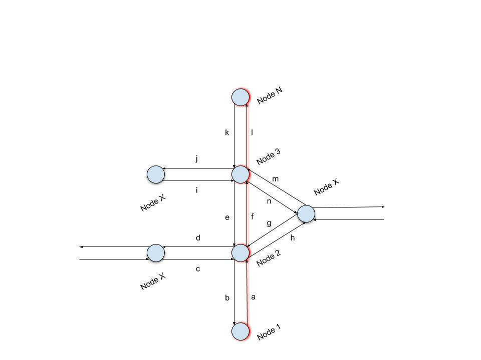
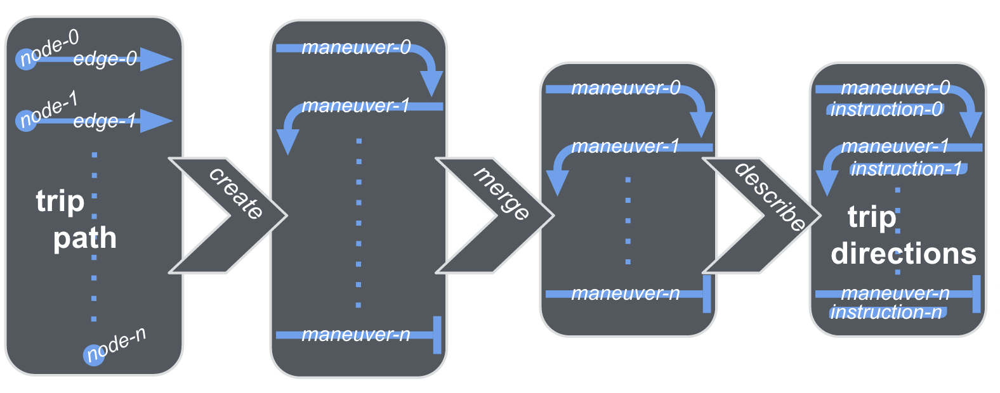

# Overview of how routes are computed
This document provides a brief overview of Valhalla route computation.

## Request Parsing
  Parse incoming request (JSON) to validate inputs. Converts (most) of the incoming request to protocol buffer objects to pass through the individual stages. The exception is currently some costing options for which parsing is deferred until needed within the costing module itself.
## Finding Candidate Edges
  The first step within a route is to find candidate edges for each incoming location. This logic is held within the *loki* directory. A set of nearby edges is found by iterating through bins within a routing graph tile or set of tiles near the location latitude, longitude. Bins are subdivided portions of Valhalla tiles that are currently .05 degrees per bin. Each bin stores a list of Valhalla edges with the bin. Edges that are allowed for the specified costing model are tested to determine the closest point along the geometry or shape of the edge. Special logic manages edges that are in disconnected regions which frequently occur in OpenStreetMap data. Additional candidate edges may be created in these cases. In addition, other filters such as filtering by heading can optionally be applied to narrow the set of candidate edges. 
## Path Computation
  Valhalla uses a couple different algorithms to generate the route path.  Code for these algorithms is held within the *thor* directory. They are all flavors of Dijkstra’s algorithm. The following classes are derived from *PathAlgorithm* (base class defining the route path interface):
  
  - *UnidirectionalAStar* - This is a forward _OR_ reverse direction A\* algorithm which is currently used for time-dependent routing and trivial paths.
  - *BidirectionalAStar* - This is a bidirectional A\* algorithm used for routes that are not time-dependent and are not trivial.
  - *MultiModal* - This is a forward direction A\* algorithm with transit schedule lookup included as well as logic to switch modes between pedestrian and transit. This algorithm is time-dependent due to the nature of transit schedules.

  All of Valhalla’s path algorithms use dynamic, run-time costing. Costing logic is held within the *sif* directory. A base class (*DynamicCost*) defines the interface that each costing model implements.  A brief overview of the costing design is located [here](sif/dynamic-costing.md). 

**Forming the Trip Path**
[TripPathBuilder](https://github.com/valhalla/valhalla/blob/master/src/thor/trippathbuilder.cc#L516) creates the Trip Path for Valhalla.  Code for this step is within the thor directory. This Trip path is a sequence of nodes and edges that will form a path.  The path is created in a forward direction from `Node 0` to `Node 1` to...`Node N`.  Edge and node attributes are added to the path which will then be passed to Odin to create Trip Directions.  Moreover, TripPathBuilder will add intersecting edge attributes at each node within the path to assist Odin with maneuver generation. 

Looking at the figure below, our path is from `Node 1` to `Node 2` to `Node 3` to...`Node N`.  The path (a, f, l) is highlighted in red.  Each arrow represents a directed edge (DE) from Node to Node. Looking at our path, when we are at `Node 2` we will store the edge information for `DE a/b` and the attributes(e.g., surface, speed, access, transit information, and etc.) for `DE a`.  Also, we will store the intersecting edge info for `c/d`, `e/f`, and `g/h`. 

**Generating Guidance**
The route narrative/guidance generating code is located in the *odin* directory.

  - *Odin* inspects the trip path nodes and edges in reverse order to form an initial list of maneuvers or steps
  - *Odin* collapses the initial maneuver list to form a concise list of maneuvers
  - *Odin* adds text and verbal instructions to form trip directions
  - *Odin* supports these [languages](api/turn-by-turn/api-reference.md#supported-language-tags) for narration instructions

## Serializing the Route Response
  The serialization of the route response takes place in the *tyr* layer of the Valhalla source code. *Tyr* is used to handle HTTP requests for a route and communicates with all of the other Valhalla APIs.  *Tyr* will format output from *Odin* and supports JSON and protocol buffer (pbf) output.
  
  - Serialization logic is split up by API (route, matrix, isochrone, height, locate, and map-matching (trace_route and trace_attributes).
  - route_serializer.cc 
    - **serializeDirections**(request, path_legs, directions_legs) → outputs a json string
      - toOSRM - Serialize route response in OSRM compatible format
      - toJSON - Returns a trip object formatted to JSON
    - **jsonToProtoRoute**(json_route, proto_route) → used by navigator
      - Transfers the JSON route information returned from a route request into the Route pbf object passed in by reference.
  - To summarize, Valhalla builds a JSON “trip” object which contains the locations, route summary with basic info about the trip, a list of legs of the trip, status, units and language.
  - A more in depth description of the results can be found [here](api/turn-by-turn/api-reference.md#outputs-of-a-route).

