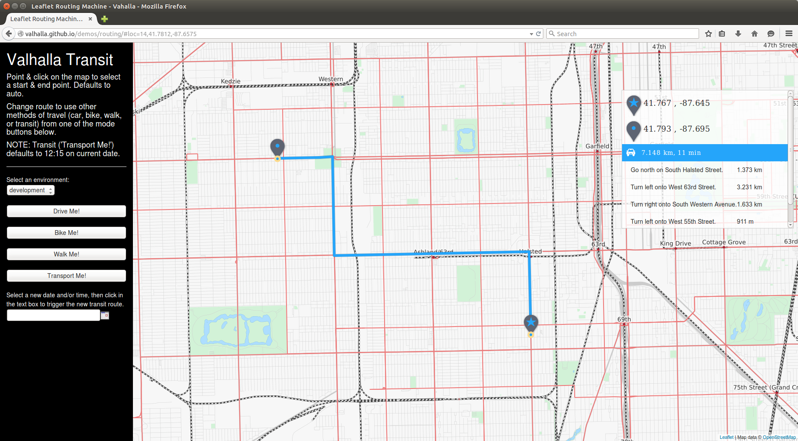
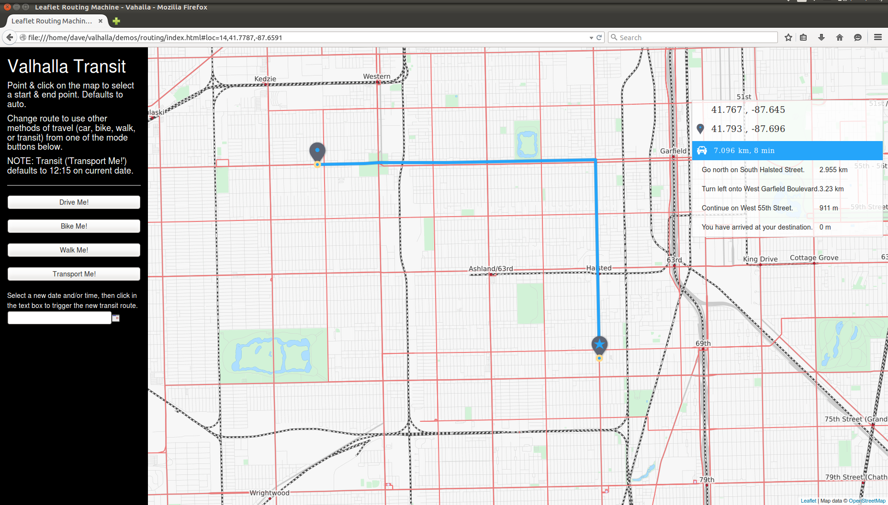

## SIF - Dynamic Costing within Valhalla

Two core components of the Valhalla open source routing engine are **Thor** and **Sif**. These 2 companions (in Norse mythoogy Thor and Sif are husband and wife) form the basis of Valhalla's path generation algorithm. Thor contains the path computation algorithms and traverses the routing tiles, while Sif performs **costing** that is central to forming the best path. Rather than baking costs into the routing graph data, Valhalla uses dynamic, run-time costing to generate costs based on a rich set of attributes stored in the routing graph tiles. This allows run-time generation of different types of routes (or routes with different characteristics) simply by using different costing methods and options within those methods.

#### Path Costing Introduction

Routing from one location to another is solved by a class of algorithms known as **shortest path algorithms**. This is somewhat misleading, as often one is interested in a route that is shortest time or one that makes fewer turns. A better term for shortest path algorithms is **least cost algorithms** - this properly indicates that the method is minimizing cost, be it distance, time, or some other metric.

Naive assignment of cost to edges of the routing graph will lead to poor routing solutions. Simple costing based solely on distance or on time (based solely on speed) can lead to poor route paths with excessive turns and stops. Considerations such as turn types, classifications of roads at intersections along the route, road surface type, elevation change, road curvature, and a host of other considerations can be important.  It is also important to note that different costing considerations are needed for bicycle routing than pedestrian routing or automobile routing.

#### Dynamic Costing

Valhalla uses dynamic, run-time costing when computing route paths and can consider much more than strict time or distance. Different route types can be computed from a single set of route data tiles. There is no need to configure data each time a new **routing profile** is needed. Simply change the costing methods or apply different options to existing costing methods, the data stays the same.

#### Costing Interface

Costing methods have access to all attributes of an edge (road section between 2 intersections) to form the cost along the edge and when transitoning between edges. Within Sif, costing methods are created by deriving a class from the base dynamic costing class or one of the existing costing classes. Each costing method must override 3 different methods to create the unique costing logic:

	virtual bool Allowed(const baldr::NodeInfo* node) const = 0;
Checks if access is allowed for the provided node. For example, node access can be restricted for specific modes of travel if bollards are present.

	virtual bool Allowed(const baldr::DirectedEdge* edge, const EdgeLabel& pred) const = 0;
Checks if access is allowed for the provided directed edge based on the prior edge along the path. This is generally based on mode of travel and the access modes allowed on the edge. It can also be used to prohibit turns where turn restrictions exist, prohibit Uturns, and to prohibit entering roads that do not have through paths.

	virtual Cost EdgeCost(const baldr::DirectedEdge* edge, const uint32_t density) const = 0;
    
This method gets the cost to traverse the specified directed edge. Cost includes a path cost along with the actual time (seconds) to traverse the edge. Path costs are generally time or distance and can include artificial cost penalties to avoid roads/edges with specific attributes. By returning the actual elapsed time in seconds the costing method can be applied to time dependent and schedule based routing (e.g. transit).

Costing methods can also compute **edge transition costs**, sometimes called turn costs. These costs are applied at the node/intersection when transitioning from one edge to another. A fourth costing method can be defined in the costing class to account for this:

	virtual Cost TransitionCost(const baldr::DirectedEdge* edge, const baldr::NodeInfo* node,
                                const EdgeLabel& pred) const;

Edge transition costs generally consider 3 things:

- **Turn type** - whether the turn is a left turn, right turn, or is crossing another road. The cost applied to the turn type also needs to know if driving is done on the left side or right side of the road. While left turns are generally more costly in the US than right turns, the opposite holds in UK.
- **Likelihood of stopping** - higher costs should be applied where there is a high likelihood of stopping when going from one road to another. Examples are when crossing a higher class road while on a lower class road. The opposite occurs when on a higher class road - transitions at intersections with lower class roads usually do not require a stop.
- **Name consistency** - this one is less intuitive. By applying small cost penalties when going from a road with one name onto one with a different name can lead to "simpler" route paths where there are less maneuvers or turns that need description.

In addition to these general cases, edge transition costing can be used to apply penalties for specific cases like crossing a country border, going onto a toll road, entering a road that has private access, and other cases where the route path might want to avoid specific roads or types of conditions!

A good example of how edge transition costs can affect a route path is a driving route in a gridded downtown area. A shortest time or distance path can make many different turns as it zig-zags from the origin to the destination. Applying edge transition costs will reduce the number of turns and create a much simpler route that is often shorter time in practice. The first image below is without edge transition costs - it makes additional turns that complicate the path description. The second image shows the path with edge transition costs applied - there are fewer turns leading to a simpler route. Note also in the first image that the estimated time is much less - this shows how important edge transition costs are to estimating the time along a route.

SIF costing for driving routes (auto) penalizes left hand turns more than right hand turns by default (in countries where driving occurs on the left hand side of the road the opposite occurs). The simple example below shows a case where a longer path is taken so that left turns are avoided. In this case, two right hand turns are made and the route is much longer (almost 700 meters rather than 100 meters).

