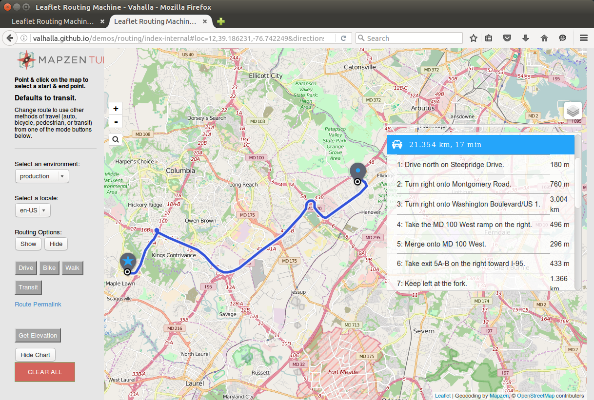
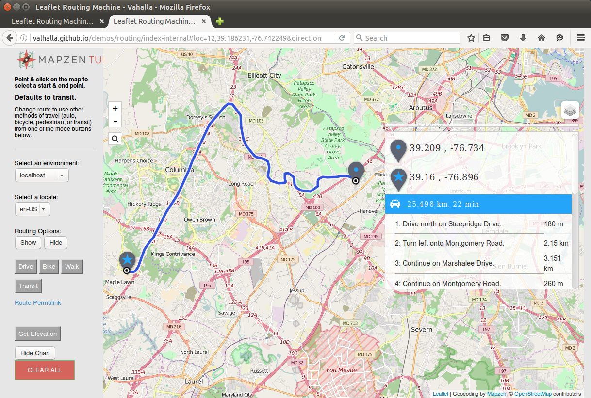

##Traffic Influenced Routing - Proof of Concept

While Valhalla does not support traffic influenced routing at the current time, the tiled routing graph design and dynamic costing methods used by Valhalla should readily support integration of both real-time and historical traffic or speed information. This paper describes a proof of concept that was developed to demonstrated traffic-influenced routing. The proof of concept allows entry of speeds for a set of OpenStreetMap (OSM) ways. These ways are then  correlated with Valhalla graph edges to generate a set of "speed tiles". These speed tiles can be thought of as "lookaside" speed tables which are used by Valhalla dynamic costing methods to produce traffic-influenced routes. The proof of concept shows how route paths change and estimated times for the route increase in the presence of congestion.

#####Speed Tiles
A key method used in the proof of concept is to create speed tiles that correlate to the existing Valhalla graph edges. The speed data is stored in a 1:1 correlation to each graph edge. This allows easy and efficient access of speed data using the existing Valhalla graph Ids that index each graph edge. Storing dynamic speed data separately from the static graph tile data also allows the dynamic speed information to be read, cached, and updated separately without impacting the more static routing tiles. The dynamic speed data is much smaller than the static graph tiles and can readily be updated and read as new routes are created. Valhalla graph tiles can remain cached. 

Speeds can be represented using a single byte per graph edge. This allows speeds from 0 to 255 kph. A specific value (e.g., 0) is used to indicate that no real-time speed exists for the edge and that the speed must be read from the Valhalla graph tile, which maintains a speed for each graph edge derived from the OSM max_speed tag or approximated based on the OSM highway tag.

The proof of concept only considered real-time speed information which meant only a single speed is maintained for each edge. Historical speed data could also be supported as a set of speeds for specific time periods for each graph edge. For example, 168 different speed values could be stored to indicate the average speed along a road segment for each hour of the week. Historical speed data would be more static - it would not be updated every several minutes but could be read in and cached just as the Valhalla graph tiles are. Historical speed data can be used to provide time-dependent speed information that shows expected traffic patterns like rush hour commuting patterns vs. mid-day weekend traffic patterns.

#####Associating Way Ids to Valhalla Edges

One possible means of specifying speed or traffic information is to associate a current speed to an OSM way. This provides an easy method of adding speed data to Valhalla. An association of way Ids to Valhalla graph Ids was created for the traffic proof of concept. This was stored as a simple CSV (comma separated values) file listing the OSM way Id and the Valhalla graph Ids of the directed edges and their direction (forward or backward) along the way. A simple process was created to read a CSV file of way Ids with a forward direction speed and a reverse direction speed along the way. This process associated the way Ids to Valhalla directed edges and stored the corresponding speeds in a real-time speed file for each Valhalla tile where edges had real-time speeds were specified. This Valhalla real-time speed tile simply stores an array of speeds in a one to one correlation to the directed edges in the tile. If a directed edge did not have any speed assigned (the majority of edges) then a value of 0 was used to indicate no speed exists. Using real-time speed tiles in this manner allows the real-time speed to be accessed using the same Valhalla graph Id as the directed edge.

For the proof of concept the process that assigns speed to OSM ways, and thus Valhalla graph edges, was executed prior to running the Valhalla server so that the real-time speeds were populated and usable by Valhalla routing. Caching of the real-time speed data was implemented only on a per route basis. This meant that each new route would load real-time speed tiles that it needed. This allowed the proof of concept to inject updated speed information and then re-run a route and see the impact of the new or additional real-time speeds. The proof of concept involved a manual entry of speed information, it was in no way automated or using real traffic data. The purpose was to prove a method of influencing Valhalla routes using auxiliary speed tiles. Methods to ingest traffic information and automatically create speed tiles was outside the scope of the proof of concept.

The downside of using OSM way Ids for traffic specification is that OSM ways can very long or very short. This can lead to difficulties when trying to localize congestion. OSM ways are often defined in such a way that manual addition or editing of a road is simplified. They often span many intersections or a long stretch of highway. When this happens, a single speed will become assigned to many graph edges and there is no way to represent variaiblity of speed along the way. Conversely, OSM ways can be very short and represent only a small portion of a road between two intersections or can represent a small overpass on a highway. In this case it becomes difficult to assign speeds to many of these short OSM ways, leading to gaps in speed coverage.

#####Dynamic Costing with Traffic

Valhalla uses dynamic, run-time costing when computing route paths. Costing methods often use speed and edge length to compute time as the costing parameter and thus create least-time routes. Currently the speed used in these computations comes from OSM max_speed tags or from a speed assigned based on highway tags (if no max_speed tag is present). A custom, dynamic costing method was created for the traffic proof of concept. This costing method uses real-time speeds if available and falls back to the OSM assigned speeds if not available.

The proof of concept did not consider how to handle edge transition costs. These are costs to traverse intersections and are used to approximate time spent stopped or waiting at intersections. With real-time traffic information many of these transition costs become part of the real-time speed for a segment of road that may traverse several intersections. It is likely that when good real-time speed coverage is available that the edge transitions costing will need to be updated to lessen the impact of transition costs and thus rely more on the real-time speed data.

####Example
The following images show an example of traffic influenced routing with Valhalla using the proof of concept described above. The examples below all use a former commuting route that I took from Elkridge, Maryland to the Applied Physics Laboratory near Laurel, Maryland.

The first image shows the route without any traffic influence. The main part of the path takes I-95 South to MD-32 West to US-29 South with an estimated time of 17 minutes.

Using the OSM way Ids along I-95 South, I created real-time speed tiles that set a current speed of 45 kph along I-95 South. With the dynamic costing method using the adjusted real-time speed data along I-95 the resulting new route detoured to take US-1 South to MD-32 West to US-29 South. US-1 has a lower speed limit and more intersections, so this route takes an estimated 19 minutes. This is shown in Figure 2.

Using the OSM way Ids along US-1 South, I added real-time speeds of 40 kph along US-1 in addition to the reduced speeds along I-95 South. With the updated real-time speed tiles and dynamic costing the new route follows local roads to MD-100 West to US-29 South. This route takes and estimated 22 minutes and is longer distance as well.

These examples show what you would expect as traffic worsens - the optimal route path may become longer distance and may take some lower class roads to find a detour. The time to reach the destination increases as the initial shortest time path becomes slower due to traffic.

Figure 1; Commute Route without Real-Time Traffic

Figure 2: Commute Route with Reduced Real-Time Speeds along I-95 South

Figure 3: Commute Route with Reduced Real-Time Speeds along I-95 South and US-1 South

####Suitability of Valhalla for Traffic Integration

Valhalla's tiled data structures should work well for potential traffic integration. First and foremost, tiling allows for efficient distribution of regional sets of speed data and also allows distributed processing of traffic data based on tiles. The concept of "look-aside" speed tiles has several advantages:

- **Easy and rapid access** using the same indexes as the Valhalla graph edges.
- **Small data size for real-time speeds.** This is crucial since real-time speeds will need to be updated frequently to provide a robust and current routing solution in presence of traffic. Latency and delay in updating current speeds needs to be kept to a minimum in a responsive traffic-influenced routing system. Small data size for dynamic speed data also makes for more efficient access during route computation as less data needs to be read from disk and cached.

The one major disadvantage of the stratefy of using look-aside speed tiles is that the speed tiles need to be matched to a specific Valhalla routing tile data set. Valhalla graph Ids are not persistent and depend on the data import process, so speed tiles need to be matched to a specific Valhalla data set so that indexes (graph Ids) match.

Work remains to be done to produce production-worthy, traffic-influenced routing within Valhalla. Here are some considerations and possibilities that we are considering.

#####Highway Hierarchies
Valhalla creates highway hierarchies in a manner similar to how roads are often presented at different zoom-levels in a map. The local hierarchy corresponds to the highest zoom levels where all roads and paths are stored or displayed. The arterial hierarchy removes residential roads, service roads, cycleways, walking paths, and other lower-class roads not generally used except when near the route origin or destination location. This is similar to a map at a middle zoom level. The highway hierarchy only includes motorways, trunks, and (currently) primary roads. This is similar to the lower zoom levels of a map where only important, higher classification roads are shown. In addition to the grouping of graph nodes and edges into the highway hierarchy, the arterial and highway hierarchy levels also contain "shortcut edges" that bypass any nodes that only connect to lower hierarchy level edges. This creates efficiency when computing long routes.

For the proof of concept, real-time speeds were only assigned to edges on the local graph hierarchy and thus were not assigned to shortcut edges. Since shortcut edges generally connect or combine edges with different OSM way Ids, the mapping of way Ids to Valhalla graph edges becomes more complicated. We have left this mapping for future efforts if needed. Alternatively, a referencing system such as OpenLR might be used to associate traffic information to Valhalla routing edges. This has many advantages which we expect to investigate in the future.

#####Possible Optimizations Using Highway Hierarchies
We are considering a shift in the way Valhalla stores the routing graph in separate highway hierarchies. There is currently duplication of edges across different highway hierarchies. For example, a motorway edge is stored in all 3 hierarchies: local, arterial, and highway. This has some nice properties when used in a bidirectional, A* algorithm. In particular, the search paths only need to transition upwards in the hierarchy (from local to arterial to highway) and never needs to transition downwards. The 2 search paths meet in the middle, usually on the highway hierarchy for any driving route. Pedestrian and bicycle routes never transition upwards, they only traverse the local hierarchy.

If Valhalla were to store each edge only on the hierarchy level which it lies then this duplication would be removed. This reduces the total size of the Valhalla graph tiles and should lead to reduced memory use as well. For traffic integration this may have even more impact. If speed data is only provided for the arterial and highway hierarchies this would greatly reduce the number of traffic tiles required to support traffic and also would reduce the total size of any speed lookaside tiles. This seems like a reasonable assumption - residential roads, service roads, parking areas, and especially cycleways and walkways do not generally need traffic data as speeds are usually consistent and traffic volumes are usually too low to generate enough probe data to get meaningful traffic information.

This type of change to the Valhalla routing graph will need to be developed, validated, and tested to make sure routing performance and quality remains high. However, this idea seems promising and is worth pursuing as we move forward with traffic investigation and integration.

Keep watch for traffic integration work in the future!
