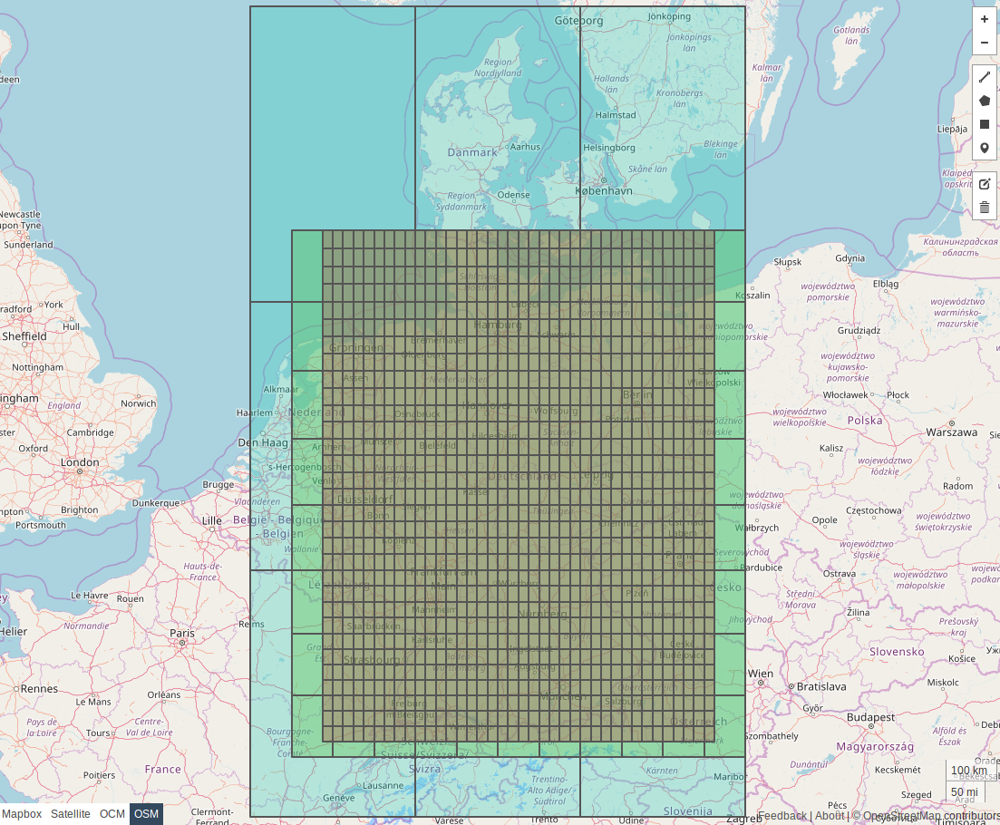

# Tile Specifications

## Hierarchies/Levels

Tiles are arranged into a hierarchy with three levels.

| Hierarchy level | Tile size, degrees | Content |
|---|---|---|
| 0 | 4° | Highway roads: motorway, trunk and primary. |
| 1 | 1° | Arterial roads: secondary and tertiary. |
| 2 | 0.25° | Local roads: unclassified, residential, service or other. |

At each level, the world ([WGS 84](https://en.wikipedia.org/wiki/World_Geodetic_System#WGS_84)) is split into rectangular tiles with a specific size using the bounding box `(-180, -90, 180, 90)`. The rows and columns start from the _bottom left_ and increase to the top right - tiles are row ordered increasing from west to east.

### The World at Level 0

The following image shows the world at level 0.


Image generated using <https://geojson.io>

Using bounding boxes for Germany, Pennsylvania, and NYC we can show how the regions would be split up into the 3 levels. Level 0 is colored in light blue. Level 1 is light green and level 2 is light red.

### Germany


Image generated using <https://geojson.io>

### Pennsylvania


Image generated using <https://geojson.io>

### NYC


Image generated using <https://geojson.io>

## Sample Tile Code

Below are some sample functions to help you obtain latitude and longitude coordinates, levels, tile ids, and lists of tiles that intersect a bounding box.

### Working with `GraphId`

```python linenums="1"
HIERARCHY_LEVEL_BITS = 3
HIERARCHY_LEVEL_MASK = 2**HIERARCHY_LEVEL_BITS - 1

TILE_INDEX_BITS = 22
TILE_INDEX_MASK = 2**TILE_INDEX_BITS - 1

OBJECT_INDEX_BITS = 21
OBJECT_INDEX_MASK = 2**OBJECT_INDEX_BITS - 1


def get_hierarchy_level(graph_id: int) -> int:
    """Hierarchy level from 64-bit representation of `GraphId`."""

    return graph_id & HIERARCHY_LEVEL_MASK


def get_tile_index(graph_id: int) -> int:
    """Tile index from 64-bit representation of `GraphId`."""

    offset = HIERARCHY_LEVEL_BITS

    return (graph_id >> offset) & TILE_INDEX_MASK


def get_object_index(graph_id: int) -> int:
    """Object (node or edge) index from 64-bit representation of `GraphId`."""

    offset = HIERARCHY_LEVEL_BITS + TILE_INDEX_BITS

    return (graph_id >> offset) & OBJECT_INDEX_MASK
```

```python
>>> get_hierarchy_level(73160266)
2
>>> get_hierarchy_level(142438865769)
1
```

```python
>>> get_tile_index(73160266)
756425
>>> get_tile_index(142438865769)
37741
```

### Working with Latitude and Longitude Coordinates

```python linenums="1"
level_to_size = {
    0: 4.0,
    1: 1.0,
    2: 0.25,
}


def get_latlon(graph_id: int) -> tuple[float, float]:
    """Latitude and longitude of tile's bottom-left corner."""

    hierarchy_level = get_hierarchy_level(graph_id)
    size: float = level_to_size[hierarchy_level]
    total_columns = int(360 / size)
    tile_index = get_tile_index(graph_id)
    lat = (tile_index // total_columns) * size - 90
    lon = (tile_index % total_columns) * size - 180

    return lat, lon


def get_tile_index_from_latlon(
    hierarchy_level: int,
    lat: float,
    lon: float,
) -> int:
    assert -90 <= lat <= 90
    assert -180 <= lon <= 180

    size: float = level_to_size[hierarchy_level]
    total_columns = int(360 / size)
    num_columns = int((lon + 180) / size)
    num_rows = int((lat + 90) / size)

    return num_rows * total_columns + num_columns


def tiles_for_bounding_box(
    left: float,
    bottom: float,
    right: float,
    top: float,
) -> list[tuple[int, int]]:
    """Return a list of tiles that intersect the bounding box."""

    assert -90 <= bottom <= 90
    assert -90 <= top <= 90
    assert bottom <= top
    assert -180 <= left <= 180
    assert -180 <= right <= 180

    # if this is crossing the anti meridian split it up and combine
    if left > right:
        east = tiles_for_bounding_box(left, bottom, 180.0, top)
        west = tiles_for_bounding_box(-180.0, bottom, right, top)
        return east + west

    # move these so we can compute percentages
    left += 180
    right += 180
    bottom += 90
    top += 90

    tiles = []
    # for each size of tile
    for level, size in level_to_size.items():
        # for each column
        for x in range(int(left / size), int(right / size) + 1):
            # for each row
            for y in range(int(bottom / size), int(top / size) + 1):
                # give back the level and the tile index
                tile_index = int(y * (360.0 / size) + x)
                tiles.append((level, tile_index))

    return tiles
```

```python
>>> get_latlon(73160266)
(41.25, -73.75)
>>> get_latlon(142438865769)
(14.0, 121.0)
```

```python
>>> get_tile_index_from_latlon(0, 14.601879, 120.972545)
2415
>>> get_tile_index_from_latlon(1, 14.601879, 120.972545)
37740
>>> get_tile_index_from_latlon(2, 41.413203, -73.623787)
756425
```

```python
>>> from pprint import pp
>>> # NYC bounding box
>>> bottom, left = (40.512764, -74.251961)
>>> top, right = (40.903125, -73.755405)
>>> x = tiles_for_bounding_box(left, bottom, right, top)
>>> pp(sorted(x))
[(0, 2906),
 (1, 46905),
 (1, 46906),
 (2, 752102),
 (2, 752103),
 (2, 752104),
 (2, 753542),
 (2, 753543),
 (2, 753544)]
```
