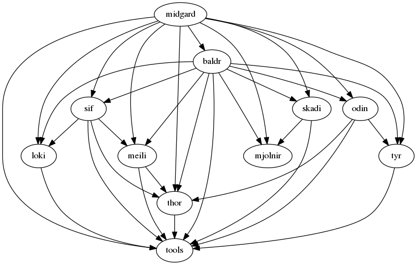

# Tools #

The tools repository is essentially a set command line executables testing the various data structures and alogrithms found in the valhalla libraries.

## Components ##

What follows are some notable tools.

## Dependencies ##



Note that this graph can be generated by checking out all the Valhalla repositories and, from the directory containing them all, run:

```
grep "PKG_CHECK.*libvalhalla_" */configure.ac | \
  sed "s,/.*\[, ,;s/\])//;s/ = unstable//g;s/libvalhalla_//g" | \
  awk '{for(i=1;i<NF;i++){print $(i+1) " -> " $1;}} BEGIN {print "digraph G {";} END {print "}";}' > valhalla.dot
dot -Tpng valhalla.dot > valhalla_dependencies.png
```
