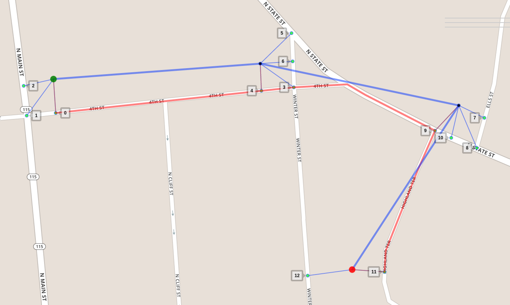

# Map Matching in a Programmer's Perspective

Meili uses a Hidden Markov Model (HMM) approach, proposed by
[Paul Newson and John Krumm in 2009](http://research.microsoft.com/en-us/um/people/jckrumm/Publications%202009/map%20matching%20ACM%20GIS%20camera%20ready.pdf),
to solve the map matching problem. The map-matching problem is
modelled as follows: given a sequence of GPS measurements
(observations in terms of HMM), each measurement has to match one of a
set of potential candidate road segments (hidden states in terms of
HMM), the problem is to find the most likely sequence of candidates.



In this figure we see a noisy GPS sequence of 4 measurements, from
green to red. Each measurement could match one of its candidates
nearby (the small markers in cyan) but which is the most likely one?
The answer is `0, 4, 9, 11` respectively. That is our most likely
sequence of candidates, which constructs the red matched route.

A good explanation about the modelling can be found
[here](https://www.mapbox.com/blog/map-matching/) and
[here](https://github.com/bmwcarit/barefoot/blob/master/MANUAL.md#background).

The problem can be formulated as a graph search problem that is
familiar to programmers. Here we briefly introduce the problem
formulation and then introduce several solutions, followed by
improvements and experiments.

## Graphical Model

Put the example above in a graphical model, it looks like this:


It is a Directed Acyclic Graph (DAG).

Each measurement has a column of nodes associated. A node (a hidden
state in terms of HMM) in the graph represents a candidate, namely a
tuple `(road segment, offset)` that tells a location on a road segment
on the map. An edge `(u, v)` means that node `u` is able to affect the
decision about `v`. Take the edge `(node 9, node 12)` as an example:
since it takes a much longer way than it looks from node 9 to node 12,
node 12 is therefore unlikely to be the match to the last
measurement. As you can see in the graph a measurement can be affected
only by its previous measurement.

Two probability models are used together to quantify how likely a
measurement would be to match a node. The emission probability
tells that closer a node stays to its measurement more likely the
measurement is to match it, while the transition probability tells
that closer the walk distance from `u` to `v` is to the measurement
distance, the more likely `v`'s measurement is to match it.

```python
# A gaussian distribution
def emission_prob(u):
    c = 1 / (SIGMA_Z * math.sqrt(2 * math.pi))
    return c * math.exp(-great_circle_distance(u.measurement, u)**2)

# A empirical distribution
def transition_prob(u, v):
    c = 1 / BETA
    # Calculating route distance is expensive.
    # We will discuss how to reduce the number of calls to this function later.
    delta = math.abs(route_distance(u, v) - great_circle_distance(u.measurement, v.measurement))
    return c * math.exp(-delta)
```

A path is a list of edges. The probability of a path is defined as
follows:

```python
def path_prob(path):
    assert path
    u, v = path[0]
    joint_prob = emission_prob(u)
    for u, v in path:
        joint_prob *= transition_prob(u, v) * emission_prob(v)
    return joint_prob
```

The task is to find the most likely sequence over all possible
sequences. For convenience's sake, we added two virtual nodes, the
source node `s` and the target node `t`, and corresponding virtual
edges to the graph with all emission and transition probabilities to
be 1.0. The task hence becomes: find a path from `s` to `t` that
maximizes the path probability.

## Solutions

To make the problem clear, a brute-force solution is given first.
Given a graph represented by a
[Adjacency List](https://en.wikipedia.org/wiki/Adjacency_list), a
source node and a target node, the procedure `maximum_path_prob` tries
hard to list all paths in between and then selects the optimal one
among them.

```python
def maximum_path_prob(adjacency_list, s, t):
    return max((path_prob(path), path)
        for path in all_paths(adjacency_list, s, t),
        key=lambda prob, path: prob)

# Generate all paths from s to t recursively
def all_paths(adjacency_list, s, t):
    if s == t: return [[]]
    paths = []
    for v in adjacency_list[s]:
        for path in all_paths(adjacency_list, v, t):
            paths.append([(s, v)] + path)
    return paths
```

[Viterbi Algorithm](https://en.wikipedia.org/wiki/Viterbi_algorithm)
is usually used to find the most likely sequence in HMM. In the DAG
the Viterbi Algorithm works like Breath-First-Search (BFS) algorithm
that searches the target level by level. During the search/expansion,
the Viterbi Algorithm also remembers each node's optimal solution (the
optimal path from the source and the path probability) and use them to
find optimal solutions for next level.

```python
def viterbi_search(adjacency_list, s, t):
    # Initialize joint probability for each node
    joint_prob = {}
    for u in adjacency_list:
        joint_prob[u] = 0
    predecessor = {}
    queue = FIFOQueue()

    queue.push(s)
    joint_prob[s] = emission_prob(s)
    predecessor[s] = None
    while not queue.empty():
        # Extract node u
        u = queue.pop()
        # Guarantee the optimal solution to u is found
        assert joint_prob[u] == maximum_path_prob(adjacency_list, s, u)[0]
        if u == t: break
        for v in adjacency_list[u]:
            # Relaxation
            new_prob = joint_prob[u] * transition_prob(u, v) * emission_prob(v)
            if joint_prob[v] < new_prob:
                joint_prob[v] = new_prob
                predecessor[v] = u
            if v not in queue:
                queue.push(v)

    return joint_prob[t], construct_path(predecessor, s, t)
```

The Viterbi Algorithm is the one used in the paper to find the optimal
path, while another approach is to use
[Topological Sort](https://en.wikipedia.org/wiki/Topological_sorting)
in the DAG. Both algorithms have to explore all edges to find the
path. However in the map-matching model exploring an edge is
expensive. During the exploration of an edge `(u, v)`, it needs to
find the shortest path between `u` and `v` *in the road network* for
calculating its transition probability. Suppose that, given a sequence
of `S` measurements and each measurement has average `T` states, the
Viterbi Algorithm or the topological sort approach will traverse all
edges i.e. do `S * T * T` times of shortest path calculations. This is
not good, especially in dense urban areas where you can easily get a
large average `T`.

To reduce the number of transition probability calculations, we use
the
[Dijkstra's algorithm](https://en.wikipedia.org/wiki/Dijkstra%27s_algorithm)
to avoid extracting those unlikely nodes as many as possible. Like the
Viterbi Algorithm, the Dijkstra's algorithm solves the problem in a
Dynamic Programming approach. The advantage of the Dijkstra's
algorithm is that it extracts nodes in a greedy way, i.e. extracts the
most likely node every time. With this strategy, as soon as the target
is extracted, the optimal solution is guaranteed to be found and thus
the rest of nodes can be safely thrown away.

Before applying the Dijkstra's algorithm we should notice that our
objective is to find the most likely path, whereas the Dijkstra's
algorithm is designed to solve shortest path problem, i.e. minimizing
a certain objective. Therefore we need to transform the maximization
problem to a minimization problem in the following way:

With following prerequisites:
```python
T = transition_prob
E = emission_prob
lg = math.log10
assert 0 <= E(u) <= 1.0 and 0 <= T(u, v) <= 1.0
```

We are maximizing `path_prob(path)` among a set of paths. Expanding
`path_prob(path)` we get:

```python
# For simplicity we ignored the last node
product(E(u) * T(u, v) for u,v in path)
```

which is equivalent to maximizing:

```python
lg(product(E(u) * T(u, v) for u,v in path))
# equivalent to
sum(lg(E(u)) + lg(T(u, v)) for u,v in path)
# because lg(a * b) == lg(a) + lg(b)
```

which is equivalent to minimizing:

```python
-sum(lg(E(u)) + lg(T(u, v)) for u,v in path)
# equivalent to
sum(-lg(E(u)) + -lg(T(u, v)) for u,v in path)

# Must be non-negative
assert 0 <= -lg(E(u)) and 0 <= -lg(T(u, v))
```

After the transformation, the emission probability of a node turns to
the node cost, and the transition probability of an edge turns to the
edge cost.

```python
def node_cost(u):
    return -1 * math.log10(emission_prob(u))

def edge_cost(u, v):
    return -1 * math.log10(transition_prob(u, v))
```

The problem becomes find a path from `s` to `t` that minimizes
`sum(node_cost(u) + edge_cost(u, v) for u, v in path)` which can be
efficiently solved by the Dijkstra's algorithm. Thanks to the
similarity to the Viterbi Algorithm, changing the FIFO queue in the
`viterbi_search` procedure to a priority queue, and the probability
calculation to the cost calculation should get you a rough Dijkstra
based solution, a greedy, lazy but faster version of the Viterbi
Algorithm.

### `TODO` Experiments

`TODO` comparison between the original Viterbi Algorithm and the
Dijkstra Viterbi Algorithm, and comparisons with and without tweaks.
