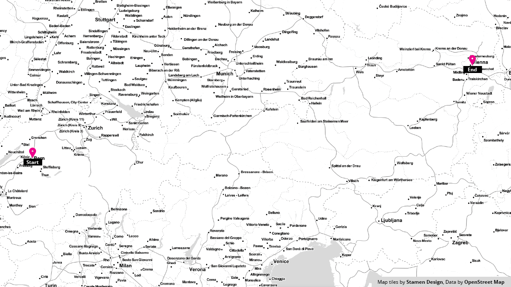

## Routing Tiles - the Who, What, When, Where, How and Why?

### A bit of the Who, When and How

We had just started our new endeavor at Mapzen and were kicking around fundamental ideas of what our system should look like. Here's a bit of a transcript of how we got here:

17/11/14 01:27 EST **Kevin:** *wakes up in a cold sweat and begins to fumble around for his phone*

17/11/14 01:28 EST **Kevin:** *violently stubs his toe on the sharpest lego he's ever witnessed*

17/11/14 01:30 EST **Kevin:** *cursing and slightly bloody, he manages to ring Dave*

17/11/14 01:32 EST **Dave:** Uhnnng...

17/11/14 01:32 EST **Kevin:** Dave! What if we route on tiled data!?

17/11/14 01:33 EST **Dave:** Um... yeah... you've been working in the mapping world for far too long

17/11/14 01:33 EST **Dave:** *throws his phone to the furthest corner of the room*

17/11/14 01:34 EST **Kevin:** Dave??

17/11/14 01:35 EST **Kevin:** *begins pacing*

17/11/14 04:17 EST **Kevin:** *still pacing*

17/11/14 07:01 EST **Kevin:** *rings dave once again*

17/11/14 07:02 EST **Kevin:** But Dave... We can have levels of detail, regional extracts, offline mobile routing... and we can open source it all

17/11/14 07:03 EST **Dave:** Hmm... Tiled. Hierarchical. Open. Routing. We could call it THOR. That's a pretty sweet acronym! That will make a great project name. But yeah... I'm not sure it'll work.

Ok, so the above is slightly embellished (everyone knows Dave stopped answering his phone after that one weekend call about traffic on the NJ Turnpike), and let's just say Kevin's proposal was met with some degree of skepticism. But after reasoned consideration the team decided that tiled, hierarchical routing data had merits and was worth pursuing.

Several months later, we have found that a tiled routing graph is possible and have begun exploring some of the benefits we'd hoped it would provide us and especially you!

This GIF gives a conceptual overview of the tiles used in a resultant graph traversal and how the level of detail needed may change depending on the connectivity of the road network in a given region.

### Show me the What, Where and Why!

So you can find all of our software at our [Valhalla](https://github.com/valhalla) github organization. There's a lot of software there but most of it is modern c++ with a little bit of python for prototypes, a bit of ruby for chef style deployment and a bit of javascript for demo'ing some of the functionality. 

#### Onto the Why!

We hope to enjoy some key benefits of a tile based approach to routing, they are as follows:

 - **Reduced memory requirements**  a connected graph can take up a lot of space in memory. By cutting the graph into a tiled structure you more easily impose limits on how much of the graph resides in memory at any one time. This could enable on device routing capabilities on even the most meager of hardware which could improve access to those in developing regions.

 - **Cacheability**  imagine a multi-level cache where an S3 bucket has a setting of constantly updated route tiles with proper http cache headers etc. Follow that up with a client side disk cache used to back a memory cache that the routing algorithm actually uses in graph traversal computations. 

 - **Updateability**  updates to the graph could be highly parallelized simply because the graph is already broken up into a tiled structure. Faster turn around times on edits would be spectacular.

 - **Regional Extracts and Off-line Routing**  you're headed to Switzerland for vacation and you don't want to pony up the Francs to get a SIM card? Before you go, or while you're on wifi, download an extract of the region. Afterall it's only 100mb or so.

 - **Return to Route**  most phone based navigation applications require contacting a server when a user deviates from the specified route path, even for common cases like stopping for fuel or food. With graph tiles downloaded along the route path, the navigation application can find a path back to the route without an expensive call to the routing server. 
 
 - **Enhanced Navigation** tiles along the route allow more detailed information to be presented along the route without having to increase the payload in the initial call to the routing service. Exits along the highway, names of upcoming roads, and other information can be presented when graph tiles are present.

We're excited with what we've accomplished so far, and look forward to showing you more soon. We plan to launch an open routing service as well as downloadable tiles later in the year. In the meantime though, [have a quick browse of the code](https://github.com/valhalla) and reach out if something doesn't make sense!
