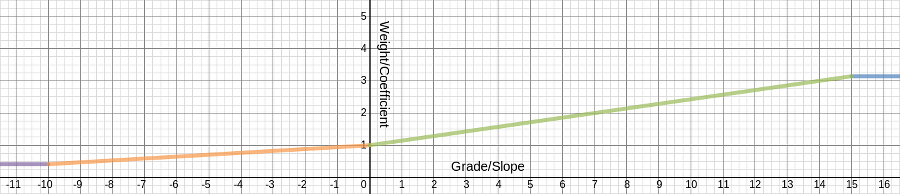
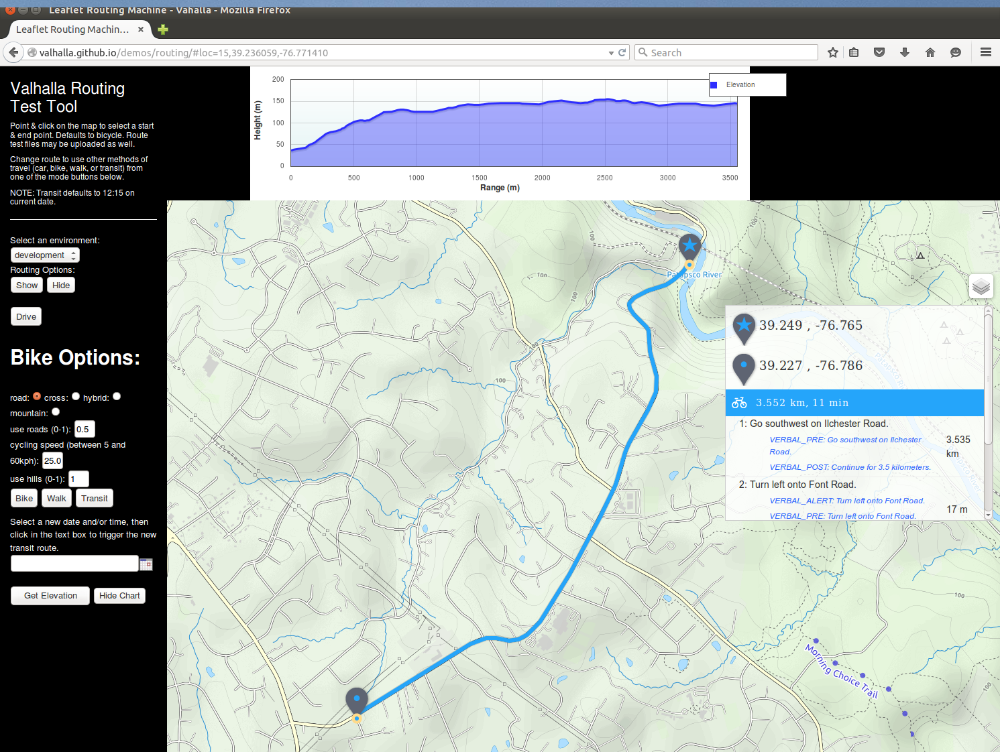
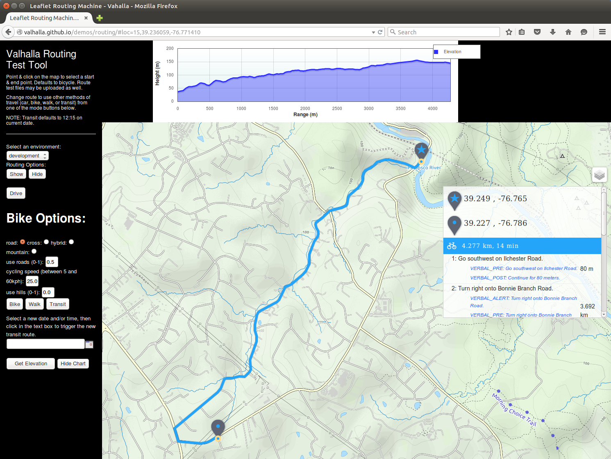

## Elevation Influenced Bicycle Routing

Mapzen and the Valhalla team recently announced updates to their bicycle routing service: [Bicycle Routing with Valhalla](https://mapzen.com/blog/valhalla-bicycle-routing-options). Now we have taken it to greater heights by adding "elevation influenced" bicycle routing. We are pleased to announce the addition of elevation and grade factors into the bicycle costing model. How badly do you want to avoid those steep hills on your next ride!?

Bicycle routing presents several unique challenges. Among the challenges are the wide range of user abilities, preferences, and equipment. Bicyclists vary in their experience and comfort level using roadways shared with larger vehicles (e.g. automobiles, buses, trucks). Different bicycle types are more or less suitable to the wide variety of road and path surfaces. The wide range of physical ability of bicyclists also comes into play when selecting routes in locations where hills and steep grades might be present. The Valhalla team at Mapzen feels these factors all play into one of the strengths of the Valhalla routing engine - its dynamic, run-time costing module known as [Sif](https://github.com/valhalla/sif). Further background on Sif can be found in our prior blog post: [Dynamic Costing in Valhalla](https://mapzen.com/blog/dynamic-costing-via-sif).

#### Addition of Elevation Factors into Valhalla Routing Tiles

In order to measure the change in elevation over a given segment of road, we've built a library (and service) called [Skadi](https://github.com/valhalla/skadi); the goddess of the mountains. Skadi has the ability to efficiently query world-wide digital elevation model data. We use this library when building routing tiles to estimate the prevaling grade/slope of a given section of road. We call this the weighted grade. Here's how it works.

Given a segment of road, we evenly sample points (at 60m apart) along it. At each sample, we measure the elevation. We then compute the grade/slope between each pair of sample points and weight it using the above function. This is essentially a linear combination designed to approximate the overall grade/slope of a given segment of road. You'll notice that sections with higher upward slope are weighted more and that conversely higher downward slopes are weighted less.

The intuition is that steeper sections will require more "cost" to traverse whether walking, biking or driving. If you're biking the unit of cost might be time, since you can't ride as fast up steep hills. When driving the unit of cost might be the fuel used to overcome inertia. In any case, we are attempting to measure approximately how much energy might be needed to traverse a given section of road so that we can minimize (or maximize!?) it, along with other factors, when computing your path!

#### Adding Grade Factors to Dynamic Costing

The weighted grade is used within bicycle costing in 2 ways:

Weighted grade impacts the speed / resulting time along an edge. The default speed used for bicycle routing is assumed to be the average speed the bicyclist can mainatin on level grades over the length of the route. This speed is modulated based on the weighted grade: increased for grades indicating a descent, and decreased for uphill grades. The higher the weighting factor the steeper the "average" grade along the edge, resulting in a higher reduction of speed results. Thus, the weighted grade of an edge impacts the time along the edge and helps avoid steep grades. It also helps provide a beter estimate of the actual time along the route. In general, routes with hills take longer than routes on level ground.

A second use for weighted grade considers the bicyclists desire to avoid or use hills in the route. A single option called use_hills has been added to the Valhalla bicycle costing module. This option is similar to the use_roads option. It is a value from 0 to 1.0 indicating the bicyclists comfort level with hills and steep grades. A value of 1.0 indicates a strong, experienced cyclists who does not mind a path with hills. A value of 0.0 indicates the cyclist wishes to find paths that try to avoid hills. Based on this fact, extra cost (penalties) are applied to edges based on the grade. Note that penalties are applied to downhill grades as well! The old adage among cyclists is that what goes down, eventually must go up so after every long downhill there will eventually be a long uphill! 

#### Examples

The following cases illustrate a set of hills I used to ride in my early days of cycling. This is an area near Ellicott City, MD starting at a point on Illchester Road along the Patapsco River and ending near the end of Illchester Road close to Montgomery Road. 

The shortest path is to head straight up Illchester Road. The problem is the initial part of the hill is roughly 16-18% for the first 400 meters. A hill-climb time trial race is held on this hill, so it is only for strong riders or those looking for a challenge. After the initial steep section, Illchester Road continues with a more gradual climb and then levels off. With a use_hills factor of 1.0 the shortest distance and shortest time path is taken - straight up the steep hill.

For those with less inclination to tackle steep grades, we can try to find an alternate path by setting the use_hills factor to 0.5. This might be for someone who doesn't want to go too far out of the way to avoid a hill. In this example the path avoids the steep section of Illchester Road, instead choosing a less steep uphill path (Bonnie Branch Road onto Beechwood Road then back onto Illchester) to get to the top of Illchester hill. Here the elevation slowly rises from 30 meters to 150 meters over approximately 2km. This is an average grade of 6% - still uphill but much less strenuous.

For a novice bicyclist or one who wishes to avoid hills, we can try a use_hills factor of 0.0. Here, a longer path up the more gradual climb along Bonnie Branch Road (approximately 5% average grade) is taken the entire way to Montgomery Road and then the path backtracks to get to the destination along Illchester Road. Here the route is nearly 1km longer than the shortest route (4.35km vs 3.5 km) and takes 3 minutes longer (14 minutes vs. 11 minutes), but with the extra cost penalties applied to the steeper grades the path ends up along the most gradual path out of the river valley.

The sample images here were created using a combination of Valhalla routing including the elevation influenced bicycle route API as well as the new [Mapzen Elevation Service](https://mapzen.com/blog/moving-on-up) API to get the range/height profile information to create the elevation chart. The output route path information (an encoded string of latitude,longitude positions along the path) is sent directly to the elevation service to get the heights along the path for charting.
