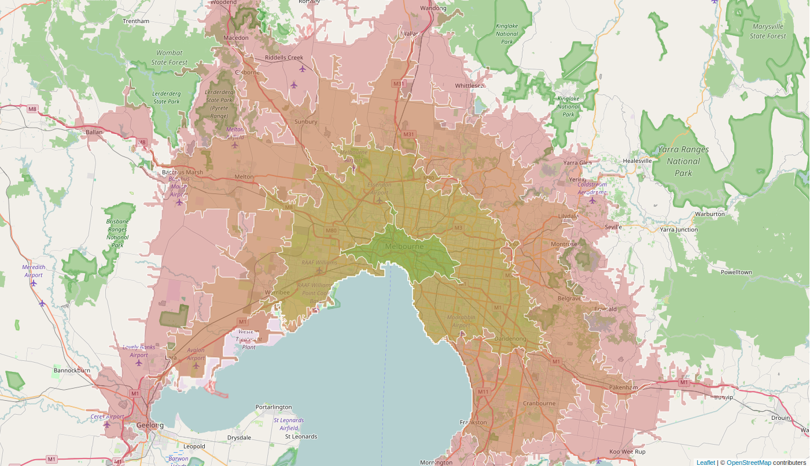

What are Isochrone Maps?
------------------------

Recently valhalla has gained the ability to return these amazing structures called isochrones. What's an isochrone? The word is a combination of two greek roots `iso` meaning equal and `chrono` meaning time. So indeed, an isochrone is a structure representing equal time. In our case it's a line that reprsents constant travel time about a given location. One can think of isochrone maps as somehwat similar to the familiar topographic maps except that instead of lines of constant height, lines are of constant travel time are depicted. For this reason other terms common in topography apply such as contours or isolines.

In this image the green, yellow, orange and red contour lines represent 15, 30, 45 and 60 minutes of driving time respectively.

How are Isochrone Maps Useful?
------------------------------

Isochrone maps can be used to make informed decisions about travel at both an individual level and en masse. You can get quantitative answeres to questions like:

 * What are our lunch options within 5 minutes from here?
 * How much of the city lives within walking range of public transit?
 * What would adding/removing this road/bus stop/bridge do to travel times?
 * Where can I find housing that still has a reasonable commute to the office?

In other words planning departments of DOTs all the way down to consumer applications will have use-cases that call for such an isochrone map service. 

Technical Details
------------------

Isochrones are formed in Valhalla by first creating a 2-D grid in latitiude,longitude about the location. This 2-D grid or array is used to define the time or cost it takes to get from the target location to each other grid location. This grid is populated by doing a breadth-first, least-cost first search (basically Dijkstra) from the origin location. At each iteration, the grid cells that are touched by a road segment or graph edge are marked with the time and cost from the origin, if less than the currently marked time. Once the expansion of the graph exceeds the maximum isochrone contour time the grid-marking process terminates. This leaves a 2-D grid or array that has the time or cost to reach each grid location.

The 2-D grid is used to find the isocrhone contours by using a well-known contouring method developed by Paul Bourke in the 1980s: [contouring](http://paulbourke.net/papers/conrec/). This method finds grid cells that have neighboring cells where values lie on opposing sides of the contour value: for example the current cell has a time value above the contour value and a neighbor has a time value below the contour value. The contouring algorithm generates line segments through grid cells corners or centers based on several possible cases. The tricky part is pieceing these line segments together to form closed contour lines.

After forming sets of contour polygons, KEVIN -please write a paragraph or 2 to describe how the contours are formed and output!

This 2-D grid of times can be useful for other purposes as well. It provides a very fast way to query a single location to see how long it takes to get there from the test location. Ultimately this could be a way to do very large one-to-many matrices. At this time we do not return the 2-D array of times, but this is a possibility in the future.

Where is it?
------------

You can find the [API documentation here](https://github.com/valhalla/valhalla-docs/blob/master/isochrones/api-reference.md) and you see a live demo of it right [here](https://valhalla.github.io/demos/isochrone/).
