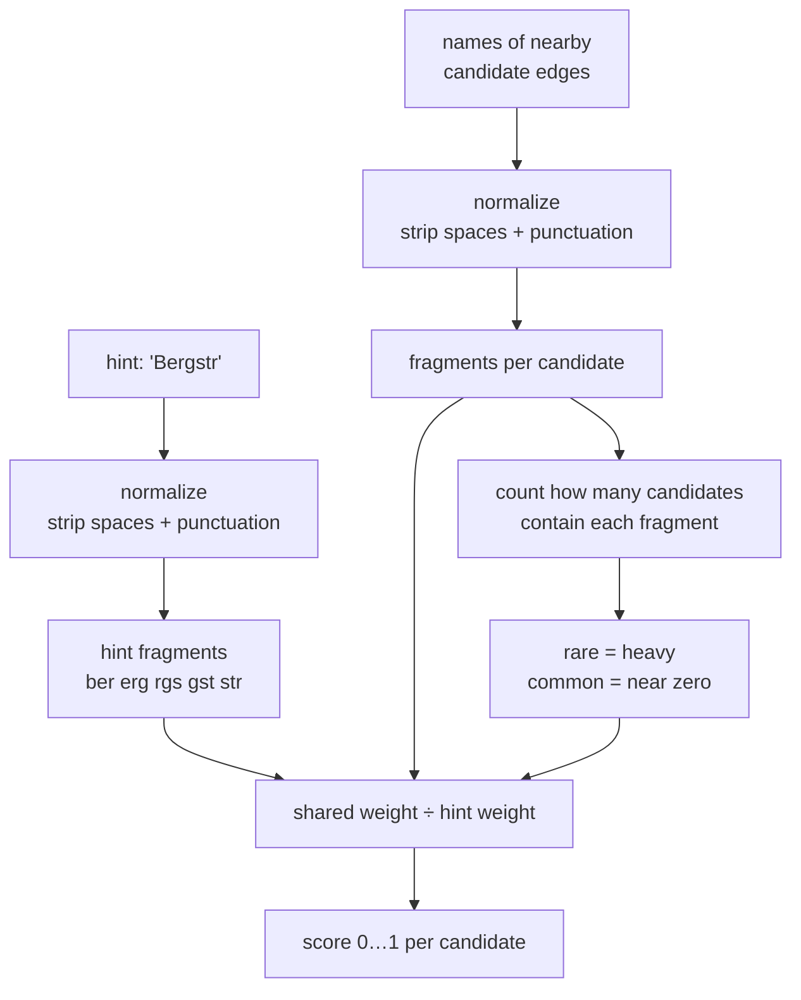

# street name hint — design notes

Companion to [geocoding_problem_description.md](geocoding_problem_description.md). Conceptual only; no
implementation, no Valhalla code referenced.

## Framing

Not one string-similarity problem, three:

1. **Normalization** — make `Primus-Truber-Str` and `Primus Truber Straße` comparable at all.
2. **Weighting** — decide that `Truber` carries the signal and `Straße` carries almost none.
3. **Aggregation + integration** — turn a similarity into a decision that doesn't wreck the geometric
   correlation.

Plain Levenshtein on raw strings fails (2) outright and fails (1) badly: an abbreviation is a run of
deletions, so `Primus-Truber-Str` → `Primus-Truber-Straße` costs 4 edits on a 17-char string, while a
genuinely different street two blocks over (`Primus-Huber-Straße`) costs 1. Edit distance is a fine
*inner* primitive on a single token; it is the wrong *outer* one.

## 1. Normalization

NFKD decompose → strip combining marks → lowercase → transliterate the letters NFKD can't touch
(ß→ss, ø→o, ł→l, đ→d, þ→th, æ→ae, œ→oe) → punctuation (`- . ' ´ ,`) becomes space → collapse
whitespace.

German users type `Mueller`, `Müller` and `Muller` interchangeably. Fold ü→u *and* expand ue→u in a
second aggressive pass, scored with a penalty, tried only if the light pass misses threshold. Same for
oe/ae.

Applied to both sides, this alone resolves the hyphen half of the problem statement.

### Runtime, not baked into tiles

Decided: normalize at query time, one function used on both the hint and the candidate names.

- **The normalizer will change.** Ship it, then discover `ł` isn't NFKD-decomposable, then add an alias.
  If normalized forms live in tiles, every fix is either a planet rebuild or — worse — a silent mismatch
  between a hint normalized by new code and tile strings normalized by an old function. A single shared
  call makes the invariant structural.
- **Works on every existing tileset.** No rebuild, no format change, no `TaggedValue`.
- **Cost is negligible.** Per-candidate, not per-edge — tens of short strings per request, against
  projection maths already running per candidate. There is no planet-scale multiplier.
- Precomputing trigram bags as bitsets is the only thing tile storage would genuinely buy, and it freezes
  the gram definition into the data too — the same versioning trap, one level deeper.

Implementation notes for later: normalize **lazily**, after the geometric/reachability filter, so
discarded candidates cost nothing. If profiling ever demands it, **memoize rather than serialize** — tile
text-list offsets are stable within a tile, so an offset→normalized cache beside the tile gets most of the
benefit with none of the format coupling.

## 2. Compounding and word order

`Hermannstraße` vs `Hermann Straße`, and `Via Roma` vs `Kossuth utca` vs `Atatürk Caddesi`, are the same
problem: the generic term can be prefixed, suffixed, or glued on. Romance/Slavic/Arabic prefix it;
Germanic/Turkic/Finno-Ugric/Chinese suffix it.

### Design A — gazetteer + token alignment

Ship ~150 street generics and abbreviations across ~15 languages. Split compound tokens on a known suffix,
canonicalize abbreviations to a generic ID, pull it into its own slot. Compare `core_tokens` by bipartite
matching over normalized Damerau-Levenshtein; score the generic separately at low weight.

Accurate and explainable, and the only thing that *truly* resolves `Str` → `Straße`. But it is a permanent
maintenance surface, it is language-detection-adjacent, and it has a tail that never ends.

### Design B — IDF-weighted character n-grams (recommended)

Strip all whitespace from both normalized strings, take character trigram bags, score with the asymmetric
overlap coefficient (`shared / smaller`), weighted by rarity.

## 3. Design B in plain language

**A trigram is a 3-character sliding window.** `bergstrasse` → `ber, erg, rgs, gst, str, tra, ras, ass,
sse`. You now hold a bag of fragments instead of a string.

A bag has no order and no word boundaries, so two things fall out for free:

- **Compounding stops mattering.** Strip spaces first and `Hermann Straße` / `Hermannstraße` both become
  `hermannstrasse` — literally the same bag. No rule, no knowledge that German compounds.
- **Word order stops mattering.** `Via Roma` and `Roma Via` give nearly the same bag, so prefix-vs-suffix
  generics never come up.

**Comparing two bags:** count shared fragments, divide by the count in the *smaller* bag. Dividing by the
smaller one is what makes abbreviations work — every fragment of `primustruberstr` also appears in
`primustruberstrasse`, so it scores 1.0 instead of being punished for the missing letters.

### The problem with doing only that

Candidates near a German address: *Bergstraße, Burgstraße, Bahnhofstraße, Schulweg*. Hint `Bergstr` →
fragments `ber, erg, rgs, gst, str`.

| candidate | shared | plain score |
|---|---|---|
| Bergstraße | 5 of 5 | 1.00 ✅ |
| Burgstraße | 3 of 5 | 0.60 ⚠️ |
| Bahnhofstraße | 1 of 5 | 0.20 |

Burgstraße lands at 0.60 purely because both end in `-gstrasse`. The generic is loud and is drowning out
the one letter that distinguishes the streets.

### IDF is the volume knob

A fragment appearing in many nearby names tells you nothing; one appearing in a single name tells you
everything. Weight each fragment by its rarity **among the candidates currently being compared**.

| fragment | in how many | verdict | weight |
|---|---|---|---|
| `str`, `tra`, `ras`, `ass`, `sse` | 3 of 4 | everywhere, ignore | 0.29 |
| `rgs`, `gst` | 2 of 4 | mildly useful | 0.69 |
| `ber`, `erg`, `bur`, `urg`, `bah`… | 1 of 4 | the signal | 1.39 |

| candidate | plain | IDF-weighted |
|---|---|---|
| Bergstraße | 1.00 | **1.00** |
| Burgstraße | 0.60 | **0.38** |
| Bahnhofstraße | 0.20 | 0.07 |

The gap between right and wrong widens from 0.40 to 0.62. Nothing told the algorithm that *Straße* is a
street-type word — it inferred it from everything nearby having it.



### Why this fits the 80% goal

- **No language tables.** Common fragments come from `caddesi` in Turkey and `calle` in Spain. Reweights
  itself per location, nothing to maintain, no country detection.
- **Typos degrade gently.** One wrong letter kills ~3 fragments out of ~15 — a dip, not a cliff.
- **Small.** Normalize, slide a window, count, intersect. No alignment, no dynamic programming.

### Caveats

- **Short names are noisy.** `Am See` yields ~4 fragments; one typo is fatal. Fall back to edit distance
  below some length.
- **Rarity needs enough candidates.** With 3 nearby streets the estimate is rubbish. See open questions.
- **Cannot separate `Hauptweg` from `Hauptstraße` on principle** — both generics get down-weighted to
  nothing, yet they are different streets that frequently coexist in one village. This specific case needs
  a small explicit generics list to penalize a mismatch, and is the one place worth spending a table.

**Recommendation:** Design B plus a ~30-entry alias table for abbreviations that are ambiguous rather than
truncating (`st`, `ul.`, `cad.`, `pl.`, `bd`), and the small generics list for the mismatch penalty above.
Reach for Design A only if measurement shows B is insufficient.

## 4. Aggregation details

These matter more than the choice of similarity function.

- **Asymmetric miss penalty.** Hint tokens absent from the candidate are strong negative evidence
  (`Primus Truber` vs `Truber Straße` → probably the wrong street). Candidate tokens absent from the hint
  are weak evidence — humans drop words. Do not make this symmetric.
- **Generic disagreement is not free.** See the `Hauptweg` caveat above.
- **Score against every name an edge carries** and take the max: `name`, the `name:xx` variants, and `ref`.
  A hint that looks like a ref (`B27`, `A9`) needs a separate near-exact regime — fuzzy matching on 3-char
  alphanumerics is meaningless.
- **Strip trailing house numbers** into a discarded slot. On a comma, use the first component; the rest is
  usually a city, optionally checkable against admin data.

## 5. Integration

Treat it as a log-likelihood addition, not a filter. The candidate score today comes from projection
distance; the hint adds a term:

```
effective_distance = distance × (1 − α · name_score)      α ≈ 0.7–0.9
```

This gives the soft-filter behaviour for free and preserves the property that actually matters: a perfect
name match 5 km away must still lose to a decent match 20 m away. A hard filter, or an unbounded bonus,
turns a *wrong* high-scoring match into a start point hundreds of metres off — which arrives later as a
"routing bug" report with no obvious cause.

Guards:

- Global threshold τ (~0.6) below which the hint is ignored entirely — the stated soft-filter fallback.
- A cap on how far the bonus may move the winner.
- **Surface whether the hint was used** in the response. Silent fallback is much harder to debug than a
  flag.
- Consider widening the search radius when a hint is present, since the usual reason for supplying one is
  an imprecise coordinate.

Nothing here touches tiles or the graph — query-time only, in the correlation step.

## 6. Validation

Generate the corpus from the tileset itself: take real OSM names and apply synthetic human corruptions —
abbreviate the generic, strip diacritics, split the compound, transpose two letters, drop a token. Measure
recall@1 against the true edge plus the false-positive rate against names from the *same* region.

That tunes τ and α on something real, and is the difference between "80% solution" and "80% solution we
can prove".

## Open questions

- **Rarity corpus: local candidate set vs. shipped static table.** Local is elegant and self-tuning but
  makes scores non-deterministic with respect to search radius. Static is stable and reproducible but is a
  versioned artifact to maintain. Leaning local.
- **Short-name fallback threshold** — at what length does trigram scoring stop being trustworthy.
- **Non-Latin scripts.** Normalized-exact and trigram scoring still function; only the alias/generics
  tables don't apply. Probably acceptable for the stated 80% target.
